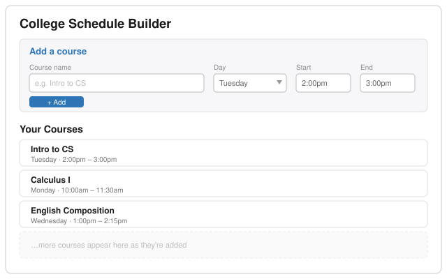
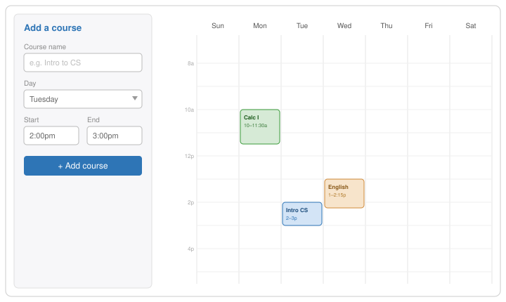

# Mini Project: College Schedule Builder

**Assigned:** 2026-06-10  ·  **Due:** 2026-06-11

## Purpose

- To develop and demonstrate foundational knowledge of **HTML and CSS** through a ReactJS project.
- To develop and demonstrate a working mastery of general **ReactJS project structure** and the develop / debug / build tools.
- To have fun.

## Task

Build a ReactJS web app that lets the user build a schedule of college classes. A user should be able to:

- **C**reate new classes to add to the schedule.
- **R**ead (view) the classes that have been added.

To keep it simple, **don't** track calendar dates (e.g. this class meets June 1, June 8, June 15…). Instead, track each course by **day of week** and **time of day** (e.g. this class meets Tuesdays from 2:00–3:00 pm).

## Inspiration

Look at existing schedule apps to see what works, what could be better, and what's missing. Pay attention to the **user interface** — what makes an interface feel smooth versus clumsy?

A good example is **CUNYFirst's Schedule Builder**. NOTE that it lets you pick existing course data from a dropdown, backed by a real course database. As a simpler alternative, you can give the user a form to type in the course data manually.

## Example Layouts

Two ways you might lay this out — pick one or design your own.

**Suggestion 1 — inputs on top, list below:** a form at the top (course name, day, start, end) with the list of entered courses beneath it.

**Suggestion 2 — form beside a weekly grid:** the same inputs on the left third; on the right, a weekly grid (Sun–Sat, no calendar dates) with color-coded blocks placed by day and time.

## Requirements and Allowances

- Your code must be tracked in a **GitHub repo from the start**, with **regular commits and pushes** throughout the project's life cycle.
- You may use **boilerplate tools** (e.g. `yarn create vite`), but you must **extend / modify** them in meaningful ways.
- You may use **AI tools** at any stage (planning, building, debugging), but you must **disclose** which AI, how, and where you used them.
- You may use **third-party packages** (e.g. a UI component library, a date/time helper) — note which ones you used and why.

## Deliverables

- A link to your **GitHub repository**.
- A **working React app** that satisfies the Task (Create + Read).
- A short **README** describing the app, how to run it, and your **AI-use disclosure**.

## Submission

- Push your final work to your GitHub repo.
- Submit the repo link via the **repo submission form** provided in slack.

## Tiered Learning (Stretch Goals)

If you finish the requirements early, keep extending it:

- **U**pdate and **D**elete operations — let the user edit and remove classes (completing full **CRUD**).
- **Drag-and-drop** that automatically updates the day and time.
- A **visual grid** where courses can be arranged.
- **Multi-day classes** — let one class meet on several days (e.g. MWF) instead of entering it multiple times.
- **Color-code classes** — assign a color per class or subject so the schedule is easy to scan.
- **Use TypeScript** — add static types to your components and data (start fresh with the `react-ts` template, or migrate).
- **Data persistence** — keep the schedule across page reloads (saving locally is much simpler than saving to a server).
- **Publish** it to GitHub Pages.
