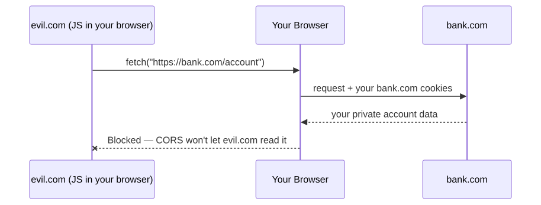
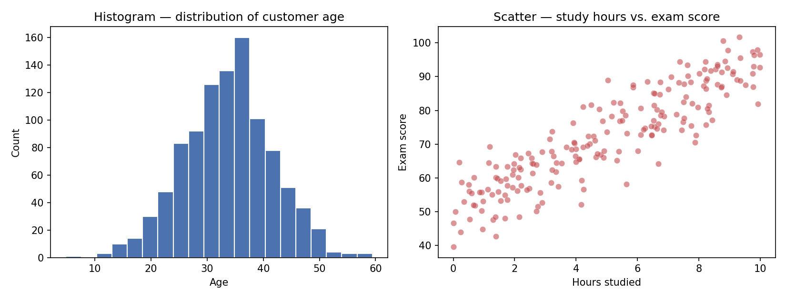

<!-- _class: lead -->
<!-- _paginate: false -->
<!-- _header: "" -->

# CityTech TTP Summer Bootcamp

## Command Line and git

**2026-06-02**

---

# Agenda

1. Review
2. Follow Up Notes
3. Smoke Tests
4. AI Discussion
5. git

---

# Review

What are the most important things you remember from yesterday?

---

# Legacy Code and Systems

- Often when you join a team, there will be legacy code and legacy systems in place.
- As a junior or mid-level engineer, it's almost impossible to change these.
- Even as a senior-level engineer or CTO, it's usually easier, safer, and cheaper to continue with what's already working.

---

# macOS vs. Windows

- **macOS** is your entry point into Unix/Linux systems — the same shell and tools you'll use on servers.
- Building **smartphone apps**? Your target users may **heavily** prefer iPhones — and you need a **Mac** to publish to the Apple App Store.
- Some industry sectors have **standard tools that only run on Windows**.

---

# The Power of SPAs

Liking a post, switching folders in Gmail, scrolling a feed — the page never does a full reload. Only the piece that changed re-renders, so the app feels instant.



---

# CORS — A Security Example

You're logged into **bank.com**. You visit **evil.com** — its JavaScript can **quietly fire a request to `bank.com` in the background, using your logged-in session, without you clicking anything or even realizing it.**

The browser sends the request, but **blocks evil.com from reading the response** unless `bank.com` explicitly allows that origin. That's what stops a random site from silently stealing your data.

---

# CORS — What the Browser Blocks



---

# EDA — Example Visualizations

Two charts you'd typically produce while first exploring a dataset:



---

# Smoke Tests

Open your terminal (macOS) or **WSL** (Windows) and confirm each tool installed correctly:

```bash
node -v
nvm --version
yarn -v
git --version
python3 --version
pip3 --version
jupyter --version
```

Then confirm GitHub recognizes your SSH key:

```bash
ssh -T git@github.com
```

Each should print a version (or a GitHub greeting) — not "command not found".

---

# Smoke Tests — Continued

Now open the desktop apps you installed and make sure each one launches:

- **VS Code** — opens, and the **GitHub Copilot** icon is active
- **Insomnia** — opens
- **pgAdmin** — opens and can connect to your **PostgreSQL** server

---

# Discussion on AI

- What exactly is AI?
- What are the promised benefits of it?
- What are the costs and risks of it?

---

# Discussion Continued

- What does it mean to use AI responsibly?
- What does it mean to use AI ethically?
- What roles does AI play in education and in work?

---

# Fishbowl Example

- What makes a good prompt?
- How can an engineer use AI to complement their skills?

---

# Intro to git

git is a distributed version control system that tracks every change to your code and lets a whole team collaborate without overwriting each other's work. GitHub is a service that hosts your git repositories online, adding pull requests, issues, and collaboration tools on top.

<style>
section img:not(.emoji) { display: block; margin: 0.6em auto; }
</style>

---

# The Four Areas of git

- **Working Directory** — the files you're editing right now
- **Staging Area** — changes you've marked with `git add` for the next commit
- **Local Repository** — your committed history, stored on your machine (`git commit`)
- **Remote Repository** — the shared copy on GitHub everyone syncs with (`git push` / `git pull`)

---

# git Areas — How Changes Flow


---

# Clone

Cloning downloads a full copy of a remote repository — every file and its complete history — onto your machine. You'll do this once to start working on a project.


```bash
git clone git@github.com:org/repo.git
```

---

# Fork

A fork is your own copy of someone else's repository, made on GitHub. It lets you experiment or propose changes without needing write access to the original (upstream) repo.


```bash
gh repo fork org/repo   # or click "Fork" on GitHub
```

---

# git vs. GitHub vs. `gh`

**git vs. GitHub** — the big picture

- **git** — the version-control *tool* that runs on your machine and tracks history
- **GitHub** — a *service/website* that hosts git repositories and adds pull requests, issues, and collaboration

**git vs. `gh`** — two different command-line tools

- **`git`** — core version-control commands (`add`, `commit`, `push`, …)
- **`gh`** — GitHub's CLI for GitHub-specific actions (pull requests, issues, forking, creating repos)

> **Tip:** Forking is best done through the GitHub **web UI** (the "Fork" button), not the CLI.

---

# Pull

Pulling fetches the latest commits from the remote and merges them into your current local branch. Run it often so your copy stays in sync with your teammates.


```bash
git pull origin main
```

---

# Anatomy of `git pull origin main`

```bash
git   pull   origin   main
```

- **`git`** — the version-control program you're running
- **`pull`** — the subcommand: fetch the latest commits and merge them in
- **`origin`** — the name of the remote (the default alias for your GitHub repo)
- **`main`** — the branch you're pulling from

---

# Push

Pushing uploads your local commits to the remote repository so others can see them. It's how your work leaves your machine and reaches GitHub.


```bash
git push origin main
```

---

# Exercise

**21 Questions over git**

https://github.com/jonathan-chin/github_practice_21_questions
