<!-- _class: lead -->
<!-- _paginate: false -->
<!-- _header: "" -->

# CityTech TTP Summer Bootcamp

## The Command Line

**2026-06-03**

---

# Review

What are the most important things you remember from yesterday?

---

# Agenda

1. Review
2. Merge Conflicts
3. Why the Command Line
4. Navigating and Files
5. Getting Help
6. Play to Practice

---

# Merge Conflicts

A **merge conflict** happens when two branches change the **same lines** of a file in different ways, and Git can't decide which version to keep.

- Common when you and a teammate edit the same file
- Git pauses the merge and asks **you** to choose
- They're normal — not a sign you did something wrong

> **No conflict if** you edited different files — or if your changes touch different parts of a file that Git can merge automatically.

---

# Why a Conflict Happens



<style>
section img:not(.emoji) { display: block; margin: 0.5em auto; }
</style>

---

# What a Conflict Looks Like

Git marks the clashing section right in the file:

```text
<<<<<<< HEAD
greeting = "Hi"
=======
greeting = "Hey"
>>>>>>> feature-b
```

- `<<<<<<< HEAD` — your current branch's version
- `=======` — the divider
- `>>>>>>> feature-b` — the incoming branch's version

---

# Resolving a Conflict — Edit It

The most common way: open the file in **VS Code** (or any editor) and choose what to keep.

- Delete the `<<<<<<<` / `=======` / `>>>>>>>` markers, leaving the version you want
- VS Code adds *Accept Current / Incoming / Both* buttons
- …and a 3-way **Merge Editor** for side-by-side resolution

---

# Resolving a Conflict — Take One Side

When you just want one branch's version of the whole file, pick it from the CLI:

```bash
git checkout --ours   greeting.js   # keep your branch's version
git checkout --theirs greeting.js   # keep the incoming version
```

---

# Resolving a Conflict — Finish or Back Out

Once the file looks right, mark it resolved:

```bash
git add greeting.js
git commit
```

Or throw away the merge and start over:

```bash
git merge --abort
```

> `git status` lists every file still in conflict.

---

<!-- _class: lead -->

# The Command Line

### Talking to your computer with text

---

# Why the Command Line?

- It's fast and scriptable once it's in your fingers
- A **GUI** (graphical user interface) is resource-intensive — it needs more powerful, more expensive hardware
- Not every task needs that — a plain terminal runs fine on cheap, minimal machines
- Remote machines (servers) often have no graphical interface at all
- Windows users: do all of this in your **WSL (Ubuntu)** terminal

---

# Anatomy of a Command

A command is usually: `command [options] [arguments]`

```bash
ls -l /home
# command: ls    option: -l    argument: /home
```

---

# Where Am I? — `pwd`, `ls`

```bash
pwd          # print working directory (where you are)
ls           # list files here
ls -a        # include hidden files (dotfiles)
ls -l        # long format: permissions, size, date
ls -la       # both at once
```

---

# Moving Around — `cd`

```bash
cd projects        # into the "projects" folder
cd ..              # up one level
cd ~               # your home directory
cd /               # the root of the filesystem
cd -               # back to the previous directory
```

Paths: `~` = home, `.` = here, `..` = parent.
**Absolute** paths start at `/`; **relative** paths start from where you are.

---

# "Directory" vs. "Folder"

- They mean the **same thing**: a container that holds files and other directories.
- **Directory** is the older, command-line term — it's why we have `cd` (**c**hange **d**irectory) and `mkdir` (**m**a**k**e **dir**ectory).
- **Folder** is the GUI term, from the file-explorer "folder" icon metaphor.
- Use them interchangeably — on the command line you'll mostly hear **directory**.

---

# Making Things — `mkdir`, `touch`

```bash
mkdir week1                 # make a directory
mkdir -p week1/exercises    # make nested directories
touch notes.md              # create an empty file (or update its timestamp)
```

---

# Copying and Moving — `cp`, `mv`

Both follow the same shape:

```bash
cp source destination     # copy
mv source destination     # move or rename
```

Examples:

```bash
cp notes.md notes-backup.md     # copy a file
mv notes.md week1/              # move into a folder
mv old.md new.md                # rename
```

---

# Deleting — `rm` (careful!)

```bash
rm notes.md          # delete a file
rm -r week1-copy     # delete a directory and everything in it
```

⚠️ There is **no Trash or Recycle Bin** on the command line.
Deletes are permanent — read the line twice before you press Enter.

---

# Looking Inside Files

```bash
cat notes.md        # print the whole file
less notes.md       # scroll a long file (press q to quit)
head notes.md       # first 10 lines
tail notes.md       # last 10 lines
tail -f server.log  # follow a file as it grows
```

---

# Getting Help and Moving Faster

```bash
man ls          # manual page (q to quit)
ls --help       # quick help for most commands
history         # commands you've run
clear           # clean up the screen
```

- **Tab** completes file and command names
- **↑ / ↓** scroll through past commands
- **Ctrl + C** cancels the running command

When you're stuck:

- Ask other engineers (peers, seniors)
- Read The Manual (**RTM**)
- Ask AI

---

# Play to Practice

1. https://cmdchallenge.com/
2. https://overthewire.org/wargames/bandit/
3. https://web.mit.edu/mprat/Public/web/Terminus/Web/main.html
4. https://github.com/veltman/clmystery
