<!-- _class: lead -->
<!-- _paginate: false -->
<!-- _header: "" -->

# CityTech TTP Summer Bootcamp

## Intro to React, HTML, and CSS

**2026-06-08**

---

# Agenda

1. Review
2. Follow Up: Issues and PRs
3. Fishbowl Stand-up
4. HTML
5. React

---

# Review

What are the most important things you remember from last week?

---

# Follow Up: Issues and PRs

On the **main course repo**:

- Keep using **GitHub issues** to ask content questions — be **specific**
- Try to figure it out yourself first; use issues as a **secondary** resource
- Someone on the instructional team will answer as soon as we can
- Want to improve the materials? Open a **pull request** — keep PRs **small and specific** in scope

---

# Fishbowl Stand-up

The instructional team will **model a stand-up** while you watch.

- Each person: what I did **yesterday**, what I'm doing **today**, any **blockers**
- Notice how short and focused it stays

---

# Websites and Web Apps

A **website** presents content; a **web app** is interactive software running in the browser. Both are built from the same core technologies:

- **HTML** — the structure and content
- **CSS** — the styling and layout
- **JavaScript** — the behavior and interactivity

**HTML and CSS are the foundation** — even React ultimately produces HTML and CSS for the browser to render.

---

# HTML — A Markup Language

**HTML** = **H**yper**T**ext **M**arkup **L**anguage.

- A **markup language** wraps content in **tags** that describe its structure and meaning — a heading, a paragraph, a list, an image
- It **describes** content; it doesn't compute (no logic or loops like a programming language)
- The browser reads your HTML and builds the page from it

---

# A First Look at HTML

```html
<article>
  <h1>Chocolate Chip Cookies</h1>
  
  <p>Ready in 30 minutes — makes about two dozen.</p>
  <a href="/recipes">More recipes</a>
</article>
```

- Nested tags are **indented** to show the structure
- `` is a **self-closing tag** — no separate closing tag needed
- Tags take **attributes** that configure them — e.g. ``'s `src` (the image file) and `alt` (a text description for screen readers, or if it fails to load)
- Whether an attribute is **required or optional** depends on the tag

---

# Official HTML References

- **MDN Web Docs — HTML** (the go-to reference)
  https://developer.mozilla.org/en-US/docs/Web/HTML
- **web.dev — Learn HTML** (Google)
  https://web.dev/learn/html
- **WHATWG HTML Living Standard** (the official spec)
  https://html.spec.whatwg.org/

---

# Code Together: Dummy HTML Chat App

Let's hand-write a static chat screen in plain **HTML** — no CSS or JavaScript yet.

- A heading with the chat room's name
- A list of messages (hardcoded for now)
- A text input and a **Send** button

> "Dummy" = it's just structure; nothing actually sends yet.

---

# Why React Emerged

- Early web pages were **static**; making them interactive meant hand-editing the DOM, step by step
- As **SPAs** grew, keeping the screen in sync with the data by hand became messy and bug-prone
- **Facebook open-sourced React in 2013** to manage complex, constantly-updating UIs (news feed, chat, notifications)
- Today it's one of the most widely used ways to build web interfaces

---

# What Is React?

- A **JavaScript library** for building user interfaces
- **Components** — reusable, self-contained pieces of UI
- **Declarative** — you describe what the UI should look like; React updates the page
- **JSX** — write HTML-like markup right inside JavaScript

---

# What Is a Function?

In programming, a **function** takes some **input**, does work, and returns an **output**.

- Same input → same output — predictable
- **Reusable** — call it again with different inputs instead of repeating yourself

```js
function greet(name) {
  return "Hello, " + name;
}
greet("Maya");  // "Hello, Maya"
```

---

# The Big Idea: UI = f(state)

A component is a **function of its data** — give it data, it returns UI. Change the data and React re-renders just that component.

```jsx
function MessageList({ messages }) {
  return (
    <ul>
      {messages.map((m) => <li key={m.id}>{m.text}</li>)}
    </ul>
  );
}
```

- **Static HTML:** you'd hand-write and edit every `<li>` yourself
- **A function:** the list is generated from `messages` — no duplication

---

# React References

- **React docs (home)** — https://react.dev
- **Learn React** (guided tutorial) — https://react.dev/learn
- **API reference** — https://react.dev/reference/react

---

# Real-World React Frontends

Open-source React apps worth exploring:

- **Excalidraw** — virtual whiteboard, client-side React + TypeScript
  https://github.com/excalidraw/excalidraw
- **tldraw** — infinite canvas and drawing
  https://github.com/tldraw/tldraw
- **TodoMVC** — the classic to-do app, small and readable
  https://github.com/tastejs/todomvc

---

# What Is Boilerplate?

**Boilerplate** is the standard, repeated setup code and config every project needs *before* you write any features — folder structure, build config, linting, base dependencies.

- The same scaffolding shows up across countless projects
- Teams start from **starter templates / generators** instead of reinventing it
- Saves time and enforces consistency across a codebase
- Trade-off: it can include things you don't need — know what it sets up

---

# Start a React + TypeScript Project

We use **Vite** (modern and fast) with the React + TypeScript template — and **Yarn**, not npm.

```bash
yarn create vite my-app --template react-ts
cd my-app
yarn          # install dependencies
yarn dev      # start the dev server
```

- `react-ts` gives you React + TypeScript boilerplate, ready to go
- Open the printed `localhost` URL to see it live

---

# Build Tools and Dev Servers

Two pieces of modern web tooling:

- **Build tool** — turns your source (many TS / JSX / CSS files) into optimized files a browser can run (`src/` → `dist/`)
  - bundled, minified, **tree-shaken** (unused code dropped), and obfuscated
- **Dev server** — runs your app locally while you develop, with **hot reload**: save a file and the change appears instantly — no manual refresh or rebuild

---

# What Is Vite?

Vite is a modern tool that is **both** a build tool and a dev server.

- `yarn create vite` — scaffolds the project (your boilerplate)
- `yarn dev` — starts the dev server with hot reload
- `yarn build` — produces the production build (`src/` → `dist/`)

---

# `src/` vs. `dist/`

- **`src/`** — your source code: the files you write (TypeScript, JSX, CSS)
- **`dist/`** — the build output: optimized, browser-ready files generated from `src/`
- You **edit `src/`**; you **never hand-edit `dist/`** — it's regenerated each build
- The browser ultimately runs what's in `dist/`

---

# Compilation and Building

**Compilation** turns your source into what browsers can actually run: TypeScript → JavaScript, JSX → JS — then it's bundled and minified.

```bash
yarn build           # compile src/ → dist/ once
yarn build --watch   # rebuild automatically on every save
```

- `yarn build` runs the project's build script (Vite) to produce `dist/`
- `--watch` keeps watching your files and rebuilds as you change them

---

# What Is Yarn? (vs. npm)

Both are **package managers** — they install and manage the libraries your project depends on (everything in `node_modules`).

- **npm** ships with Node; **Yarn** is a popular alternative — the one we use
- Both read **`package.json`** and write a lockfile for reproducible installs (`yarn.lock` vs. `package-lock.json`)

```text
npm install          →  yarn
npm install <pkg>    →  yarn add <pkg>
npm run <script>     →  yarn <script>
npm uninstall <pkg>  →  yarn remove <pkg>
```

---

# Why SPAs? (Reminder)

Traditional sites reload the **whole page** from the server on every click. A **single-page app (SPA)** loads once, then updates only the parts that change.

- **App-like feel** — no jarring full-page reloads
- **Less data** after the first load — fetch just the data, not whole pages
- **UI keeps its state** as you move around
- React is built for this: components re-render when their data changes

---

# Pause and Check Your Mental Model

The development loop, start to finish:



---

# Components: The Mental Model

- A **component** is a function: **props in → UI (JSX) out**
- You build your interface as a **tree** of nested components
- They're **reusable building blocks** — think LEGO bricks
- A component can hold its own **state** and re-renders when that state changes

---

# Composing Components

Break a screen into components, then nest them into a tree. **Props flow down** (parent → child); **events flow up** (child → parent via callbacks).



<style>
section img:not(.emoji) { display: block; margin: 0.4em auto; }
</style>

---

# Code Together — Build a Fake Chatroom

Let's build a simple chat UI together — no real backend, messages just live in React **state**.

- **ChatRoom** — holds the list of messages in state
- **MessageList** — renders all the messages
- **Message** — displays a single message
- **MessageInput** — text box + send button that adds a message

> "Fake" = messages are stored in state, not sent anywhere.

In class reference repo: [https://github.com/jonathan-chin/ttp-citytech-2026-summer-example-react-chat-app](https://github.com/jonathan-chin/ttp-citytech-2026-summer-example-react-chat-app)
