<!-- _class: lead -->
<!-- _paginate: false -->
<!-- _header: "" -->

# CityTech TTP Summer Bootcamp

## JavaScript, TypeScript, and React

**2026-06-09**

---

# Agenda

1. Review
2. Follow-Ups
3. JavaScript and TypeScript
4. Code Along: Imports and Hierarchy
5. JSON, Objects, and Faker
6. DevTools

---

# Review

What are the most important things you remember from yesterday?

---

# Follow Up: GitHub Authentication

GitHub no longer accepts your **account password** for git operations - you must use **token-based auth** (an SSH key or a personal access token).

- Why: passwords get reused and phished; **tokens are scoped, revocable, and safer**
- This is why we set up an **SSH key** in Week 1

Read more: https://github.blog/security/application-security/token-authentication-requirements-for-git-operations/

---

# Are You on Token Auth?

Check how your repo connects to GitHub - look at the **origin** remote:

```bash
git remote -v
```

- **`git@github.com:...`** → **SSH** (uses your SSH key) ✓ - what we set up
- **`https://github.com/...`** → **HTTPS** (needs a personal access token)

---

# Switching the Remote URL

Point `origin` at the other protocol if you need to:

```bash
# HTTPS → SSH
git remote set-url origin git@github.com:OWNER/REPO.git

# SSH → HTTPS
git remote set-url origin https://github.com/OWNER/REPO.git
```

Confirm with `git remote show origin`.

---

# Follow Up: More React Resources

The **official** React docs - authoritative, but technical:

- **Learn React**: https://react.dev/learn
- **API Reference**: https://react.dev/reference/react

Friendlier, still reliable:

- **The Odin Project**: https://www.theodinproject.com
- **Scrimba**: https://scrimba.com
- **freeCodeCamp**: https://www.freecodecamp.org

---

# Follow Up: Handling Form Data

- The example repo's input-reading code is **just okay** - fine for now
- In practice, I usually reach for **React Hook Form** to handle input, **sanitation**, and **validation**
- We'll cover that later

---

# Intro to JavaScript

**JavaScript (JS)** is the programming language of the web - it runs in every browser and adds **behavior** to a page.

- Respond to clicks, update content, fetch data
- Runs in the browser (and on servers via Node)

---

# JavaScript Everywhere

Thanks to **Node.js** - a runtime that runs JavaScript outside the browser - one language spans the whole stack:

- **Frontend**: in the browser (React, etc.)
- **Backend**: servers and APIs (Node.js, Express)
- **Desktop**: Electron (VS Code, Slack)
- **Mobile**: React Native

This is what makes **full-stack development** in a single language possible. (Code that runs on both client and server is called **isomorphic** / **universal** JavaScript.)

---

# Intro to TypeScript

**TypeScript (TS)** is JavaScript **plus types** - it's built **on top of** JavaScript and compiles down to plain JS.

- JavaScript is **dynamically typed** - types are only checked as it runs
- TypeScript adds **static types** - mistakes are caught *before* it runs
- **Any valid JavaScript is valid TypeScript**: use pure JS, or mix JS and TS freely
- The browser never runs TS directly; it's compiled to JavaScript first

---

# `add` - JavaScript vs. TypeScript

<div class="columns">

```js
// JavaScript
function add(a, b) {
  return a + b;
}
```

```ts
// TypeScript
function add(a: number, b: number): number {
  return a + b;
}
```

</div>

- **Dynamic typing (JS)**: `a` and `b` can be anything; types are checked only when it runs, so a bad type fails at runtime
- **Static typing (TS)**: `a` and `b` are declared as `number`; a wrong type is caught *as you write*, before it runs

<style scoped>
.columns { display: grid; grid-template-columns: 1fr 1fr; gap: 1rem; }
</style>

---

# JavaScript and TypeScript References

- **MDN - JavaScript** (the JS reference)
  https://developer.mozilla.org/en-US/docs/Web/JavaScript
- **javascript.info** (modern JS tutorial)
  https://javascript.info/
- **TypeScript Handbook** (official docs)
  https://www.typescriptlang.org/docs/

---

# Code Along

Follow along **first** - we may be in slightly **different project states**, so let's stay in sync before you run ahead.

---

# Import Statements

`import` pulls code and assets into a file:

```ts
import { useState } from "react";  // named import from a package
import "./styles.css";             // import a static file (CSS)
```

- **Named import**: `{ useState }` grabs a specific export from a package
- **Static file import**: e.g. a CSS file; the bundler includes it in the build

---

# Relative vs. Absolute Paths

- **Relative**: from the current file: `./Button`, `../utils/format`
- **Absolute**: from a package or a configured root: `react`, `@/components/Button`
- **Prefer relative paths for now**: simpler, with no extra setup

---

# Components Form a Hierarchy

Your app is a **tree** of components. What you import **high up** flows **down** to everything beneath it.

- Import a **CSS** file near the top (e.g. in `App`) and its styles apply across the whole tree
- (diagram on the next slide)

---

# How a Top-Level Import Propagates



`App` imports global `styles.css`; `MessageList` imports a smaller-scoped CSS that only affects its own subtree.

<style>
section img:not(.emoji) { display: block; margin: 0.4em auto; }
</style>

---

# Continue Coding

Keep working on your dummy chat app.

- What else do you think it needs?
- Can you think of a way to **simulate a person chatting back**?
- Capture your thoughts in a **design doc** - or at least a **`TODO.md`** file

---

# Design Docs and TODO Files

- A **design doc** is a short written plan - *what* you're building, *why*, and *how* (approach, structure, open questions) - written as you design, before you write much code
- A **`TODO.md`** is a simple running checklist of tasks and ideas, kept in the repo
- Both make your thinking visible, keep you organized, and look great on your GitHub
- On a **team**, they're how everyone stays **in sync** - a shared plan and a shared to-do list

---

# JavaScript Objects

A JS **object** groups related data as **key-value pairs**.

```js
const user = {
  name: "Maya",
  age: 25,
  isAdmin: false,
};
user.name; // "Maya"
```

- Keys are names; values can be any type - even other objects or arrays
- The core way to model "a thing" in JavaScript

---

# JSON

**JSON** = **J**ava**S**cript **O**bject **N**otation - a text format for data, modeled on JS objects.

- The common language of **APIs** and config files - data sent as plain text
- Like a JS object, but keys and strings use **double quotes**; no functions or comments

```json
{
  "name": "Maya",
  "age": 25,
  "isAdmin": false
}
```

---

# Faker Libraries

**Faker** libraries generate realistic **fake data** - names, emails, dates, sentences, avatars.

- Perfect for **seeding** a UI before a real backend exists (e.g. your fake chatroom)
- Test with believable data instead of "test test test"

Install it:

```bash
yarn add @faker-js/faker
```

Then use it:

```js
import { faker } from "@faker-js/faker";
faker.person.fullName(); // "Maya Johnson"
faker.lorem.sentence();  // "Quasi aut sint..."
```

---

# Live Debugging with DevTools

Your browser's **DevTools** (Web Inspector) let you debug a running page. Open with **F12** or right-click → **Inspect**.

- **Elements**: inspect and live-edit the HTML and CSS
- **Console**: run JS, read logs and errors
- **Network**: watch requests and responses
- **Sources**: set **breakpoints** and step through code line by line
