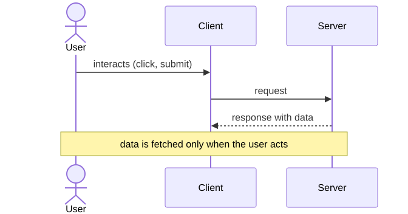
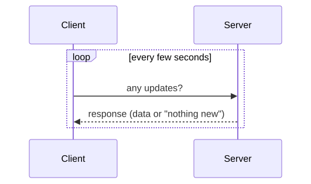
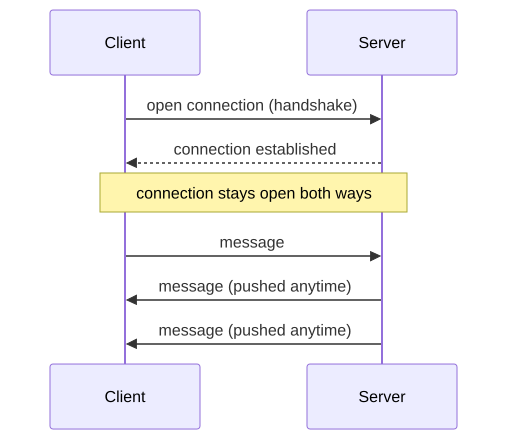

<!-- _class: lead -->
<!-- _paginate: false -->
<!-- _header: "" -->

# CityTech TTP Summer Bootcamp

## TypeScript, TanStack Query, and Real-Time Data

**2026-07-01**

---

# Agenda

1. Review
2. Follow-Ups
3. React Hook Form
4. TypeScript
5. TanStack Query
6. Client-Server Communication
7. Mini Project: Celebrity Name Chain

---

# Review

What are the most important things you remember from yesterday?

---

# Follow Up: Match Your Git Email to GitHub

Your local git **email** must match an email on your **GitHub** profile. GitHub uses the commit email to attribute the commit, so if they don't match, your contributions **won't be tagged to you**.

Check what git is currently using:

```bash
git config --global user.name
git config --global user.email
```

Set them to match your GitHub account:

```bash
git config --global user.name "Your Name"
git config --global user.email "you@example.com"
```

Use the same email that appears in your GitHub account settings (a **verified** email).

---

# Follow Up: A Peek at Data Analytics

Once your commits are tagged to you, that data can be **analyzed**. Here is a tool built for our course that visualizes contributions to any public repo:

https://jonathan-chin.github.io/github-collaborator-visualizer/

- Point it at a **public GitHub repo** (like your Scattergories project)
- It pulls the data straight from **GitHub's public API**, right in the browser
- See each contributor's share as a **pie chart**, **timeline**, **treemap**, and **table**
- Measure by **commits**, **lines added / removed**, **churn**, or **net lines**

A small taste of turning raw data into insight, which is what **data analytics** is all about.

---

# Follow Up: WSL and `/mnt/c` Is Slow

Many of you used **VS Code + WSL** with projects under **`/mnt/c/...`** (the Windows drive). That path is slow.

- WSL runs Linux in a lightweight VM with its own fast **Linux filesystem** (`~/`, `/home/you`)
- `/mnt/c` is the **Windows** drive, reached across the VM boundary; every file read and write pays a toll
- Worst for **many small files**: `npm install`, `git status`, dev-server builds (often **5–10× slower**)
- **File watching breaks too**: edits under `/mnt/c` may not trigger reloads, so **hot reload silently stops working**

---

# Follow Up: Keep Projects in the Linux Home

**Rule of thumb:** keep your projects in the **Linux filesystem**, not `/mnt/c`.

Check where you are; if `pwd` starts with `/mnt/c`, move the project:

```bash
pwd                      # /mnt/c/Users/you/... ->  too slow
cd ~                     # your fast Linux home
mkdir -p ~/projects      # keep projects here instead
```

Then open the folder in VS Code **from inside WSL**:

```bash
cd ~/projects/myapp
code .                   # launches VS Code connected to WSL
```

This is also Microsoft's official recommendation.

---

# Follow Up: The VM Boundary



Reaching `~/projects` stays inside Linux and is fast; reaching `/mnt/c` crosses the VM boundary on every read and write.

---

# Follow Up: This Mirrors the Real World

This is exactly the kind of problem you hit **supporting many devices and platforms** in the real world.

- Your users run **different OSes, browsers, and hardware** than you do
- A bug can be invisible on **your** setup and obvious on **theirs**
- I didn't catch the `/mnt/c` issue quickly because I **haven't developed on Windows in a long time**, if ever

The lesson: **test on the platforms your users actually use**, not just your own. It ties back to **hybrid apps**: shipping everywhere means verifying everywhere.

---

# Follow Up: A Real Ionic App

Here is a **real, shipped** hybrid app built with Ionic: **Share Meals**.

- Built with **Ionic** and **React**, with **Capacitor** for native features
- One codebase deployed to **web and mobile**
- The same pieces you're learning (pages, components, routing, forms), at production scale

https://github.com/share-meals/sma-v4

Let's take a look.

---

# React Hook Form: Refresher

Yesterday we met **React Hook Form** for managing forms without wiring up `useState` and `onChange` for every field.

- **`useForm()`** gives you `control`, `handleSubmit`, and more
- Wrap custom components like **`IonInput`** in a **`Controller`**
- **`handleSubmit(onSubmit)`** collects the values and hands them to you

```tsx
const { control, handleSubmit } = useForm();
// <form onSubmit={handleSubmit(onSubmit)}> ... </form>
```

---

# React Hook Form: Clearing the Form

Yesterday's form sent a message but never **cleared the input**. With React Hook Form you don't touch the DOM, you call **`reset()`**.

- `reset()` restores the form to its **`defaultValues`**
- Because `IonInput` is **controlled** (`value={field.value}`), clearing the state clears the screen too
- Set `defaultValues` so a cleared field becomes `""`, not `undefined`
- No more `document.getElementById(...).value = ""` like the old chat app

---

# React Hook Form: Clearing (Example)

Clear the **whole form** after submit:

```tsx
const { control, handleSubmit, reset } = useForm({
  defaultValues: { name: "", message: "" },
});

const onSubmit = (data) => {
  console.log(data);
  reset();                          // every field back to its default
};
```

Clear **only certain fields**:

```tsx
reset({ message: "" });             // reset one field, leave the rest
reset({ name: "", message: "" });   // reset several at once
```

---

# Coding Demo: React Chat App with Ionic and RHF

Let's rebuild our chat app together, the better way:

- **Ionic** components for the UI (`IonInput`, `IonButton`, `IonList`)
- **RHF** to handle the form (`Controller` + `handleSubmit`)
- **`reset()`** to clear the message field after each send

No more reading and clearing the input straight from the DOM.

---

# A Closer Look at TypeScript

TypeScript adds **types** to JavaScript. You annotate a value **inline** by writing a colon and the type right after the name: `value: Type`.

```tsx
// on a variable definition
const count: number = 0;
const username: string = "Ada";

// on a function's arguments (and its return type)
const greet = (name: string): string => `Hello, ${name}`;

// on a destructured object argument
const Greeting = ({ name, age }: { name: string; age: number }) =>
  <p>{name} is {age}</p>;
```

The pattern is always the same: **`name: type`**, whether it's a variable, an argument, or a whole object.

---

# `type` and `interface`

Instead of repeating an object shape inline, give it a **name** and reuse it.

```ts
// a type alias
type User = {
  name: string;
  age: number;
};

// an interface: nearly the same for object shapes
interface User {
  name: string;
  age: number;
}
```

Then use the name anywhere:

```tsx
const Greeting = ({ name, age }: User) => <p>{name} is {age}</p>;
```

Rule of thumb: reach for **`interface`** for object shapes, **`type`** when you also need unions and other combinations.

---

# Built-in Types

TypeScript ships with the primitives and a few handy extras:

- **`string`**, **`number`**, **`boolean`**
- **`string[]`** (or `Array<string>`) for arrays
- **`any`**: opt out of checking; **`unknown`**: unknown but safe
- **`void`**: a function that returns nothing
- **`null`**, **`undefined`**
- **Unions**: `string | number` (one type *or* another)

Full list: https://www.typescriptlang.org/docs/handbook/2/everyday-types.html

---

# Quick and Dirty: Escape Hatches

When the type checker is in your way and you just need to move, TypeScript has escape hatches:

```ts
const data: any = fetchThing();   // turn off checking for this value

// @ts-ignore
brokenLine();                     // ignore the error on the next line

// @ts-nocheck                    (at the top of a file)
// ignore type errors for the whole file
```

These are only meant to be **temporary**. They silence errors instead of fixing them, so use them sparingly while you work things out and **do not ship them in production code**.

---

# Enforcing the Rules: `tsconfig`

A project's **`tsconfig.json`** can turn on restrictions that forbid the loose stuff:

- `"strict": true` enables a bundle of strict checks at once
- `"noImplicitAny": true` refuses values that fall back to `any`
- Projects often **ban `@ts-ignore`** too (usually through lint rules)

**Tighter restrictions are generally better**: they catch bugs early and lead to more reliable code. But sometimes **speed** matters more, especially while debugging or prototyping.

The trade-off: **speed vs reliability**.

---

# Introducing TanStack Query

Fetching server data by hand (`useEffect` + `useState`) means juggling **loading flags, errors, caching, and refetching** yourself, over and over.

**TanStack Query** manages that **server state** for you:

- **Caching** and automatic **background refetching** to keep data fresh
- Built-in **loading** and **error** states
- **Dedupes** identical requests and **retries** failed ones

Formerly *React Query*, it's become the **de facto standard** for data fetching in React (and works with Vue, Svelte, and Solid too).

---

# TanStack Query: PokéAPI Example

```bash
yarn add @tanstack/react-query
```

```tsx
import { useQuery } from "@tanstack/react-query";

const Pokemon = () => {
  const { data, isLoading, error } = useQuery({
    queryKey: ["pokemon", "pikachu"],
    queryFn: () =>
      fetch("https://pokeapi.co/api/v2/pokemon/pikachu").then((res) => res.json()),
  });

  if (isLoading) return <p>Loading...</p>;
  if (error) return <p>Something went wrong</p>;
  return <p>{data.name} weighs {data.weight}</p>;
};
```

---

# What `useQuery` Gives You

`useQuery` returns an object; we destructure the parts we need:

- **`data`**: the fetched result (`undefined` until it arrives)
- **`isLoading`**: `true` while the first request is in flight
- **`error`**: set if the request fails

These are **state**. Like `useState`, when any of them changes TanStack Query tells React to **re-render** the component, so the UI always reflects the latest status: loading, then error or data.

---

# TanStack Query: Mutations

`useQuery` **reads** data. **`useMutation`** **changes** it: create, update, delete (`POST`, `PUT`, `DELETE`).

- Unlike a query, a mutation does **not** run on its own; you call **`mutate(...)`** when you're ready (for example, on submit)
- It tracks status too: **`isPending`** while it runs, plus **`error`** and an **`onSuccess`** callback
- After it succeeds, you usually **invalidate** related queries so they refetch the fresh data

Docs: https://tanstack.com/query/latest/docs/framework/react/guides/mutations

---

# Example: `useMutation`

```tsx
import { useMutation, useQueryClient } from "@tanstack/react-query";

const NewAnswer = () => {
  const queryClient = useQueryClient();

  const { mutate, isPending } = useMutation({
    mutationFn: (answer) =>
      fetch("/answers", {
        method: "POST",
        body: JSON.stringify({ answer }),
      }).then((r) => r.json()),
    onSuccess: () => {
      queryClient.invalidateQueries({ queryKey: ["game"] });
    },
  });

  // later, on submit:  mutate("Elvis Presley");
};
```

`mutate(...)` fires the request; `onSuccess` **invalidates** the `["game"]` query so it refetches.

Let's build a **Pokémon lookup** together, using everything from today:

- **Ionic** for the UI (`IonInput`, `IonButton`, `IonList`)
- **RHF** to capture what the user types
- **TanStack Query** to fetch from the **PokéAPI**, keyed on the search term

Type a name, fetch the Pokémon, show the result.

---

# Official Documentation

**TanStack Query**

- https://tanstack.com/query/latest

**React state variables (`useState`)**

- Guide: https://react.dev/learn/state-a-components-memory
- Reference: https://react.dev/reference/react/useState

---

# Client-Server Communication: Regular Requests

The classic model: the client **asks** the server for data, and the server **responds**.



Data is retrieved **only on user interaction** (a click, a submit, a page load). Nothing arrives unless the client asks first.

---

# When Regular Requests Fall Short

This model is **fine for most things**: loading a page, submitting a form, looking up a Pokémon.

But it can't handle **real-time** needs, where data changes on the **server** and the user should see it **without acting**:

- A **chat app**: new messages should appear instantly
- A **game**: other players' moves must show up live
- A **stock monitor**: prices update every second on their own

The user would have to keep refreshing the page or clicking a "reload" button over and over. We need a better model.

---

# Client-Server Communication: Polling

**Polling**: the client re-asks the server on a **timer** (TanStack Query's `refetchInterval`), checking for new data whether or not anything changed.



The server can't push on its own, so the client keeps asking.

---

# Polling: Pros and Cons

**Pros**

- **Simple**: it's just regular requests on a timer, no special server setup
- **Works everywhere**, using the same request/response you already know
- **Good enough** when updates are infrequent or a small delay is fine

**Cons**

- **Wasteful**: most requests come back with nothing new
- **Not truly real-time**: updates lag by up to one interval
- **Scales poorly**: more clients and shorter intervals mean more load
- You're stuck trading **freshness** (short interval) against **efficiency** (long interval)

---

# Client-Server Communication: WebSockets

A **WebSocket** opens a single, **persistent** connection that stays open. After that, **either side** can send a message at any time, no repeated requests.



The server can finally **push** data to the client the moment something changes.

---

# WebSockets: Pros and Cons

**Pros**

- **True real-time**: the server pushes instantly, in **both directions**
- **Efficient**: one open connection, no repeated request overhead
- Ideal for **chat**, **games**, and **live collaboration**

**Cons**

- **More complex**: needs a stateful server that holds every connection open
- **Harder to scale**: each connected client is an ongoing resource
- Extra concerns: **reconnection**, **auth**, and fallbacks
- **Overkill** when updates are rare, where regular requests are simpler

---

# Other Models Exist

These three are the common ones, but not the whole picture:

- **Long polling**: hold each request open until there's data to send back
- **Server-Sent Events (SSE)**: a **one-way** stream, server to client
- **WebRTC**: **peer-to-peer** connections, for audio, video, and data

Rule of thumb: pick the **simplest** model that meets your real-time needs.

---

# Polling with TanStack Query

Add **`refetchInterval`** to a query and it polls on a timer:

```tsx
const { data } = useQuery({
  queryKey: ["messages"],
  queryFn: () => fetch("/api/messages").then((r) => r.json()),
  refetchInterval: 3000,   // refetch every 3 seconds
});
```

- Default is `false` (no polling)
- Pass a **function** for a dynamic interval, or to stop by returning `false`
- `refetchIntervalInBackground: true` keeps polling when the tab is hidden

---

# Coding Demo: TanStack Query Polling

Let's make our app update **on its own** with polling:

- A `useQuery` with **`refetchInterval`**
- Watch the data refresh without anyone clicking
- Feel the trade-offs we discussed: fresh vs. wasteful

---

# Mini Project: Celebrity Name Chain

Build the **Celebrity Name Chain** game: each player names a celebrity whose **first name** starts with the **first letter of the previous celebrity's last name**.

- "Albert **E**instein" → "**E**lvis Presley" → "**P**ablo Picasso" ...
- A natural fit for today's tools: **Ionic**, **RHF**, and **TanStack Query**
- Full spec in a separate file: `project_specs/celebrity-name-chain.md`

---

# Today's Exit Ticket

- [ ] Match your **git config email** to your GitHub profile
- [ ] Explain the **VM boundary** and how it affects your workflow
- [ ] Use **React Hook Form**
- [ ] Add **types** in TypeScript, both **inline** and with **`type` / `interface`**
- [ ] Explain the **pros and cons** of TypeScript **escape hatches**
- [ ] Explain and use **TanStack Query**
- [ ] Explain the **three models** of client-server communication: **regular requests**, **polling**, and **WebSockets**
