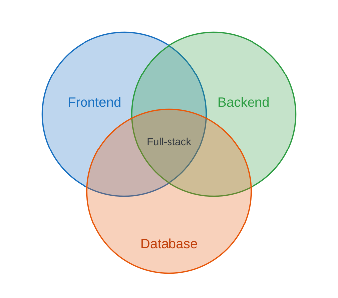

<!-- _class: lead -->
<!-- _paginate: false -->
<!-- _header: "" -->

# CityTech TTP Summer Bootcamp

## Full-Stack Development and Mutations

**2026-07-02**

---

# Agenda

1. Review
2. Follow-Ups
3. TanStack Query Mutations
4. Celebrity Name Chain

---

# Review

What are the most important things you remember from yesterday?

---

# Follow Up: The Polling Demo

Yesterday's **TanStack Query polling** example is now in the repo, as a live message board:

- **`server/`** — a tiny Express API: `GET /` lists messages, `POST /` adds one
- **`client/`** — an Ionic app that **polls** `GET /`, so new messages appear on their own
- Run the server, expose it with **ngrok**, then **POST** with Insomnia to watch polling work

Code: `demos/tanstack-polling` (`server/` + `client/`)

---

# Follow Up: Full-Stack Development

<style scoped>
.columns { display: grid; grid-template-columns: 1fr 1fr; gap: 1.5rem; align-items: center; }
</style>

<div class="columns">
<div>



</div>
<div>

A web app is built in three major layers:

- **Frontend** — the UI users see (React, Ionic)
- **Backend** — server, logic, and APIs (Express)
- **Database** — where the data lives (PostgreSQL)

Where all three meet is **full-stack**.

</div>
</div>

---

# Follow Up: Which Layers Should You Learn?

**One layer** (specialist)

- Pro: deep expertise, clear roles (frontend, backend, DBA); valued at larger companies
- Con: fewer roles fit you, and you rely on others to ship a whole feature

**Two layers** (e.g. frontend + backend)

- Pro: knowing one sharpens the other (e.g. frontend that slots cleanly into your backend); very hireable
- Con: still lean on a specialist for the third (often the database or ops)

**All three** (full-stack)

- Pro: build a whole app end to end; ideal for startups, small teams, and prototypes
- Con: hard to go deep everywhere; risk of "jack of all trades, master of none"

---

# TanStack Query: Mutations

`useQuery` **reads** data (`GET`). **`useMutation`** **changes** it: create, update, delete (`POST`, `PUT`, `DELETE`).

- A mutation does **not** run on its own; you call **`mutate(...)`** when ready (e.g. on submit)
- It tracks status: **`isPending`** while it runs, plus **`error`** and an **`onSuccess`** callback
- On success, **`invalidateQueries`** marks the matching query stale so it **refetches** the fresh data

Docs: https://tanstack.com/query/latest/docs/framework/react/guides/mutations

---

# Example: `useMutation`

A mutation that posts a new message, then refetches the list:

```tsx
const queryClient = useQueryClient();
const { mutate, isPending } = useMutation({
  mutationFn: (newMsg) =>
    fetch(`${API_URL}/`, {
      method: "POST",
      headers: { "Content-Type": "application/json" },
      body: JSON.stringify(newMsg),
    }).then((r) => r.json()),
  onSuccess: () =>
    queryClient.invalidateQueries({ queryKey: ["messages"] }),
});
```

Call `mutate({ name, message })` on submit. `isPending` **disables the button** while it posts; `onSuccess` refetches the list.

---

# Celebrity Name Chain

Pick up your **Celebrity Name Chain** project and keep building.

- Start from the template repo (**Use this template**, one repo per team)
- Bring together everything: **Ionic**, **RHF**, **TanStack Query**, and your **Express + Prisma** API
- Full spec: `project_specs/celebrity-name-chain.md`

---

# Today's Exit Ticket

- [ ] Submit your **Celebrity Name Chain** repo link to the **Google Form** on Slack
- [ ] Explain the **overall design** of your approach to the project
- [ ] Explain and use **`useQuery`** and **`useMutation`** in TanStack Query
