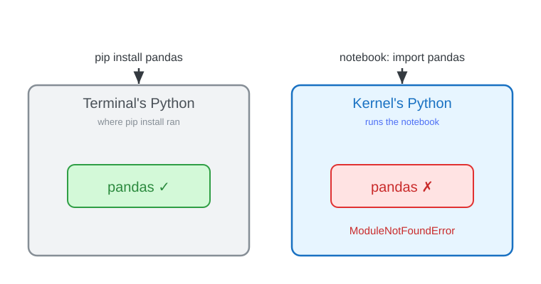

<!-- _class: lead -->
<!-- _paginate: false -->
<!-- _header: "" -->

# CityTech TTP Summer Bootcamp

## Data Wrangling

**2026-07-07**

---

# Agenda

1. Review
2. Follow-Ups
3. Dirty vs Clean Data
4. Wrangling Techniques
5. Practice

---

# Review

What are the most important things you remember from yesterday?

---

# Follow Up: Clean pgAdmin Backups

Restoring a dump onto an existing database fails with "already exists" errors — unless the dump **drops the old objects first**.

In pgAdmin's **Backup** dialog, open the **Query Options** tab and enable:

- **Include DROP DATABASE statement** — adds `DROP` commands so a restore clears the old objects first
- **Include IF EXISTS clause** — makes those drops safe when nothing is there yet (only valid with the option above)
- **Include CREATE DATABASE statement** — if the dump should recreate the database too

Then your `dump.sql` restores cleanly on any machine.

---

# Follow Up: Installing pandas (and Friends)

Libraries must go into the **environment your kernel runs in**.

The safe way from **inside a notebook** installs into the *running* kernel:

```python
%pip install pandas
```

Gotcha: a plain `pip install` in the wrong shell hits a **different Python** → `ModuleNotFoundError`.

---

# Follow Up: Two Different Environments

Your terminal and your notebook can be **separate Python environments** — `pip install` lands the package in one, while the kernel looks in the other.



---

# Continue: Squirrel Census EDA

Back to yesterday's notebook: `demos/eda-squirrel/squirrel_eda.ipynb`.

- Reopen it and **Restart Kernel and Run All Cells** for a clean start
- Keep exploring: try `value_counts()` on `age`, `shift`, and `location`
- Notice the rough edges: missing values, a date stored as a number

Those rough edges are our next topic.

---

# Dirty Data vs Clean Data

Real-world data is usually **dirty** — it needs work before you can trust an analysis.

**Dirty data** has:

- **Missing** values (blanks, `NaN`)
- **Inconsistent** formats ("NYC" vs "New York")
- **Duplicates**, typos, and wrong **types** (a date stored as a number)
- **Outliers** and impossible values

**Clean data** is consistent, correctly typed, de-duplicated, and ready to analyze.

---

# Data Wrangling

The broad umbrella term is **data wrangling** (a.k.a. **munging**): turning raw, messy data into a usable form.

It covers a range of steps:

- **Cleaning** — fix missing values, duplicates, wrong types, bad formats
- **Transforming** — reshape, derive new columns, aggregate
- **Combining** — merge and join data from multiple sources

**Cleaning** is usually the first and biggest part — so we'll start there.

---

# Cleaning: Missing Values

Real data has gaps — blank cells that pandas shows as **`NaN`**.

- **Find** them: `df.isna().sum()` counts missing per column
- **Drop** rows or columns with `dropna()`
- **Fill** (impute) with `fillna()` — a constant, the mean/median, or forward-fill
- It's a judgment call: dropping loses data, filling makes assumptions

---

# Missing Values: Code

```python
# count missing per column
df.isna().sum()

# drop rows missing a fur color
df = df.dropna(subset=["primary_fur_color"])

# or fill missing ages with a placeholder
df["age"] = df["age"].fillna("Unknown")
```

---

# Cleaning: Duplicates

Duplicate rows sneak in from merges, re-exports, or double entries — and they **skew counts and averages**.

- **Find** them: `df.duplicated().sum()`
- **Remove** them: `df.drop_duplicates()`
- Drop by a **subset** of columns when only some define a "duplicate"

---

# Duplicates: Code

```python
# how many fully-duplicate rows?
df.duplicated().sum()

# drop exact duplicate rows
df = df.drop_duplicates()

# or treat rows as duplicate by a subset of columns
df = df.drop_duplicates(
    subset=["hectare", "shift", "date", "hectare_squirrel_number"]
)
```

---

# Cleaning: Data Types

A column read as the wrong **type** breaks analysis — a date stored as an integer, or numbers stored as text.

- **Check** types: `df.dtypes` (or `df.info()`)
- **Convert** simple casts with `astype()`
- **Parse dates** with `pd.to_datetime()`
- Correct types unlock the right operations (date math, numeric stats)

---

# Data Types: Code

```python
# the squirrel "date" is an int like 10142018
df["date"] = pd.to_datetime(df["date"].astype(str), format="%m%d%Y")

# cast a column to a category
df["age"] = df["age"].astype("category")
```

---

# pandas Data Types (dtypes)

| dtype | Holds | Like Python's |
| --- | --- | --- |
| `int64` | whole numbers | `int` |
| `float64` | decimals (holds `NaN`) | `float` |
| `bool` | True / False | `bool` |
| `string` (`str`) | text | `str` |
| `category` | a fixed set of labels | no direct one |

**`category`** has no Python counterpart: like an **enum**, it stores each label once and cells as codes — ideal for few-valued columns (fur color, shift): less memory, faster grouping.

---

# Cleaning: Standardize Formats

The same thing written many ways ("NYC", "nyc", " New York ") counts as **different values** unless you normalize it.

- **Trim** whitespace and fix **casing**: `.str.strip()`, `.str.lower()`
- **Unify** labels and codes with `replace()` or a mapping
- Consistent formats make grouping and joining reliable

---

# Standardize: Code

```python
# trim whitespace and normalize casing
df["primary_fur_color"] = df["primary_fur_color"].str.strip().str.title()

# map inconsistent labels to one form
df["shift"] = df["shift"].replace({"am": "AM", "pm": "PM"})
```

---

# Cleaning: Outliers

**Outliers** are extreme or impossible values — a negative age, a $1M coffee. They can distort means and models.

- **Spot** them with `describe()`, a histogram, or the min/max
- Decide: **remove**, **cap** (clip to a limit), or **flag** and keep
- Not every outlier is an error — sometimes it's the interesting part

---

# Outliers: Code

```python
# spot the range
df["hectare_squirrel_number"].describe()

# keep only plausible values
df = df[df["hectare_squirrel_number"] <= 20]

# or cap extremes instead of dropping
df["hectare_squirrel_number"] = df["hectare_squirrel_number"].clip(upper=20)
```

---

# Cleaning: Rename Columns

Clear, consistent column names make everything downstream easier to read and type.

- **Rename** specific columns with a mapping: `rename(columns=...)`
- Standardize a **convention** (e.g. lowercase `snake_case`)
- Do it early so the rest of your code reads cleanly

---

# Rename: Code

```python
# rename specific columns
df = df.rename(columns={
    "primary_fur_color": "fur_color",
    "hectare_squirrel_number": "squirrel_no",
})

# or lowercase every column name
df.columns = df.columns.str.lower()
```

---

# Transforming: Binning

**Binning** groups a continuous number into labeled **buckets** — ages into "child / adult / senior", or counts into "low / high".

Why bin?

- **Simpler to read**: a few groups instead of hundreds of distinct values
- **Reveals patterns**: trends per bucket stand out more than raw numbers
- **Enables grouping**: now you can `value_counts()`, group, and chart by category
- **Human-meaningful**: "senior" says more than "age 71"

Trade-off: binning **loses precision** — bin when the groups matter more than exact numbers.

---

# Binning: Code

```python
# bucket squirrel counts into low / medium / high
df["density"] = pd.cut(
    df["hectare_squirrel_number"],
    bins=[0, 3, 8, 100],
    labels=["low", "medium", "high"],
)

df["density"].value_counts()
```

---

# Combining: Merge / Join

**Merging** combines two DataFrames by matching rows on a shared **key** column — just like a SQL join.

- `df.merge(other, on="key")` lines up rows where the key matches
- `how=` controls what to keep: **inner** (matches only), **left**, **right**, **outer**
- Great for **enriching** data — pull in details from another table

---

# Merge: Code

```python
# a lookup table: hectare -> zone
hectares = pd.DataFrame({
    "hectare": ["01A", "01B", "02A"],
    "zone":    ["north", "north", "south"],
})

# attach each squirrel's zone by matching on `hectare`
df = df.merge(hectares, on="hectare", how="left")
```

---

# Wrangle the Squirrel Census

Back in `demos/eda-squirrel/squirrel_eda.ipynb`, let's clean it up together:

- **Types**: parse `date` (an int) into a real date
- **Missing**: handle the 55 missing `primary_fur_color` values
- **Rename**: give the long columns shorter, clearer names
- **Bin**: bucket `hectare_squirrel_number` into low / medium / high

Then re-run `describe()` and `value_counts()` on the cleaner data.

---

# Wrangling Is Full of Choices

Every wrangling step is a **judgment call** — reasonable analysts would choose differently:

- Drop rows with missing data, or fill them (and with what — mean? median? zero?)
- Which outliers are **errors** to remove vs. **real** values to keep?
- Where do the bin edges go? "Adult" starts at what age?
- Which rows and columns to keep or filter out?

None of these are purely objective — each one **shapes the result**.

---

# The Garden of Forking Paths

Statistician **Andrew Gelman**'s idea: even an honest analyst walks a **branching maze** of reasonable choices.

- Each decision is a **fork**; different forks lead to different results
- You might run only **one** analysis — but it was one path out of many
- So a striking finding can be an **artifact of the path** you took, not a real effect

(The name is from a Borges story — a labyrinth of forking paths.)

---

# Same Data, Many Stories

- **Data is (relatively) objective** — the recorded facts
- **Data analysis tells a story** — shaped by the choices you make
- **Data analysis can tell many stories** — different honest paths, different conclusions

Be **transparent** about your choices, and **skeptical** of any single story — including your own.

---

# Code Along: Mural Census

Your turn — wrangle a messy dataset end to end, then merge.

- Data: `demos/eda-murals/` — `murals.csv` + `condition_reports.csv` (5,000 rows each)
- Start your own **`practice.ipynb`** in that folder
- Apply the techniques: **rename, fix types, missing, duplicates, standardize, outliers, bin**
- Then **merge** the two tables on `m_id`

(Fake data, generated for practice — messy on purpose.)

---

# Pair Programming: Fridge Census

Pair up and wrangle a fresh messy dataset together.

- Data: `demos/eda-fridge/` — `fridges.csv` + `stocking_log.csv` (5,000 rows each)
- One **driver** (types), one **navigator** (guides) — then switch
- Apply every technique: **rename, fix types, missing, duplicates, standardize, outliers, bin**
- Then **merge** the two tables on `f_id`

(Fake data, generated for practice — messy on purpose.)

---

# Today's Exit Ticket

- [ ] Explain the difference between **dirty** and **clean** data
- [ ] Explain **data wrangling** (and how **cleaning** fits under it)
- [ ] Clean a DataFrame: **missing values**, **duplicates**, **types**, **formats**, **outliers**, **renaming**
- [ ] **Bin** a continuous column into categories
- [ ] **Merge** two DataFrames on a shared key
- [ ] Explain the **garden of forking paths** — how wrangling choices shape the story
