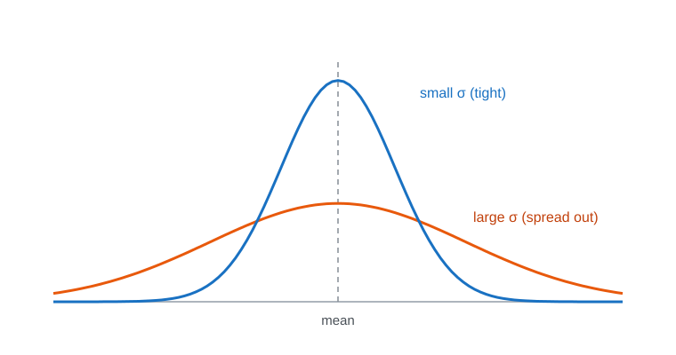
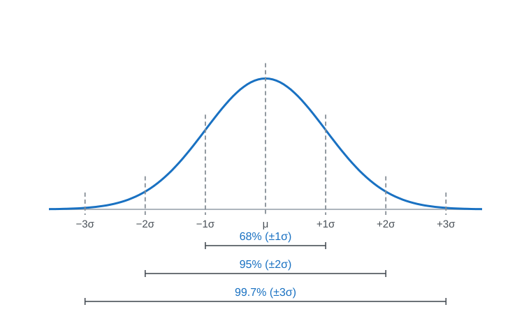
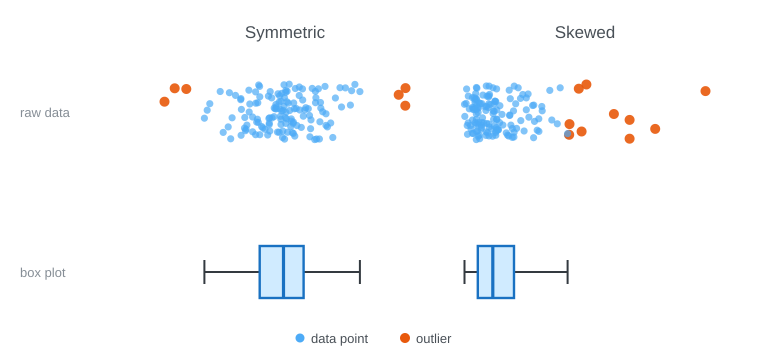
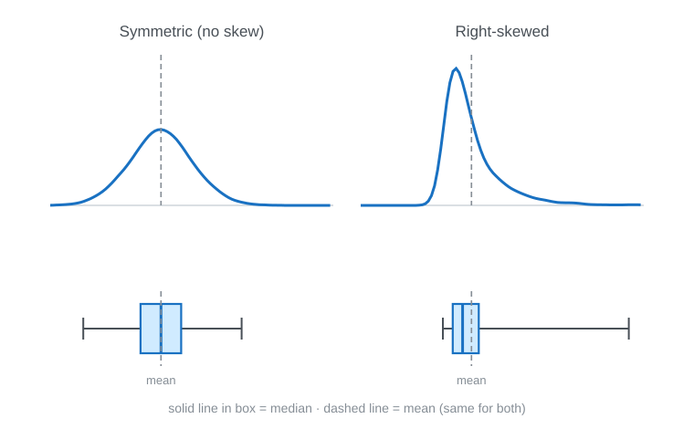

<!-- _class: lead -->
<!-- _paginate: false -->
<!-- _header: "" -->

# CityTech TTP Summer Bootcamp

## Describing Data and Telling Stories

**2026-07-08**

---

# Agenda

1. Review
2. Follow-Ups: Standard Deviation and Quartiles
3. Writing Pythonic Code
4. Transforming and Combining Data
5. The Garden of Forking Paths
6. Practice

---

# Review

What are the most important things you remember from yesterday?

---

# Follow Up: Why Standard Deviation?

The **mean** alone can hide a lot - two datasets can share a mean yet look nothing alike:

- A: `[68, 70, 71, 71]` - mean **70**, tightly clustered
- B: `[40, 60, 80, 100]` - mean **70**, widely spread

We need one number for **how spread out** the data is. That's **standard deviation**, written **σ** (the Greek letter *sigma*).

---

# Standard Deviation: The Math

$$\sigma = \sqrt{\frac{1}{N}\sum_{i=1}^{N}(x_i - \mu)^2}$$

1. Find the mean **μ**
2. Take each value's **distance from the mean**, and **square** it
3. **Average** the squared distances → the **variance**
4. **Square root** the variance → the standard deviation **σ**

---

# Standard Deviation: In Plain Words

Standard deviation is the **typical distance** of a value from the mean.

- **Small σ** → values huddle **close** to the mean (consistent)
- **Large σ** → values are **spread far** from the mean (variable)
- It's in the **same units** as the data (dollars, inches, points)
- Rule of thumb (bell-shaped data): about **68%** of values fall within **one σ** of the mean

---

# Standard Deviation: Picture It



Same mean, different spread - the **narrow** curve has a **small σ**, the **wide** curve a **large σ**.

---

# The 68-95-99.7 Rule

For bell-shaped data, σ predicts how much falls within each band of the mean:



---

# Follow Up: Why Quartiles?

The mean and σ get **distorted by outliers** and skew. Quartiles don't.

- Salaries (thousands): `[30, 32, 35, 38, 40, 500]`
- The **mean** (~112) is dragged up by one value; the **median** (~36) isn't
- Quartiles describe spread by **position**, so they're **robust** to extremes

---

# Quartiles: The Definition

Sort the data, then split it into **four equal parts** at three cut points:

- **Q1**: the **25th percentile** (a quarter of the data is below it)
- **Q2**: the **50th percentile**, the **median**
- **Q3**: the **75th percentile** (three quarters below it)

**IQR** (interquartile range) = **Q3 − Q1** - the spread of the middle **50%**.

---

# Quartiles: In Plain Words

Quartiles mark where a value stands relative to everyone else.

- **Q1**: the bottom **25%** are below it
- **Q2 / median**: right in the **middle**
- **Q3**: only the top **25%** are above it
- The **IQR** is the range of the "typical" middle half - narrow means clustered, wide means spread

---

# Quartiles: Picture It

The **box plot** (bottom) summarizes the raw **data** (top) - for a symmetric and a skewed dataset:



Box = **Q1-Q3**, line = **median**, whiskers reach the rest, dots beyond = **outliers**.

---

# Same Mean and σ, Different Skew

Both distributions have the **same mean and same σ** - one symmetric, one skewed - so those numbers can't tell them apart. The **box plots** expose the skew:



---

# One Obvious Way

Python favors **one clear, obvious way** to do a common task - not a dozen clever ones.

- The aim is code that's **readable** and instantly recognizable to any Python developer
- Write with the language's grain: lean on **built-in features** instead of reinventing them
- Code that does this is called **Pythonic**

---

# The Zen of Python

Python's guiding principles ([PEP 20](https://peps.python.org/pep-0020/)) - try `import this`:

```text
Beautiful is better than ugly.
Explicit is better than implicit.
Simple is better than complex.
Flat is better than nested.
Readability counts.
There should be one-- and preferably only one --obvious way to do it.
```

---

# JS vs Python: Iterating

<style>
.cols { display: grid; grid-template-columns: 1fr 1fr; gap: 1.2rem; }
.cols pre { margin: 0.2rem 0; }
</style>

<div class="cols">
<div>

**JavaScript**

```js
items.forEach((item, i) => {
  console.log(i, item);
});
```

</div>
<div>

**Python**

```python
for i, item in enumerate(items):
    print(i, item)
```

</div>
</div>

---

# JS vs Python: Build a List

<div class="cols">
<div>

**JavaScript**

```js
const nums = [-2, 3, -1, 4];
const result = [];
for (const x of nums) {
  if (x > 0) result.push(x * x);
}
```

</div>
<div>

**Python**

```python
nums = [-2, 3, -1, 4]
result = [x * x for x in nums if x > 0]
```

</div>
</div>

---

# JS vs Python: Truthiness

<div class="cols">
<div>

**JavaScript**

```js
if (items.length > 0) { ... }

if (items.length === 0) { ... }
```

</div>
<div>

**Python**

```python
if items:
    ...

if not items:
    ...
```

</div>
</div>

---

# JS vs Python: Two Lists at Once

<div class="cols">
<div>

**JavaScript**

```js
for (let i = 0; i < names.length; i++) {
  console.log(names[i], scores[i]);
}
```

</div>
<div>

**Python**

```python
for name, score in zip(names, scores):
    print(name, score)
```

</div>
</div>

---

# Transforming: Binning

**Binning** groups a continuous number into labeled **buckets** - ages into "child / adult / senior", or counts into "low / high".

Why bin?

- **Simpler to read**: a few groups instead of hundreds of distinct values
- **Reveals patterns**: trends per bucket stand out more than raw numbers
- **Enables grouping**: now you can `value_counts()`, group, and chart by category
- **Human-meaningful**: "senior" says more than "age 71"

Trade-off: binning **loses precision** - bin when the groups matter more than exact numbers.

---

# Binning: Code

```python
# bucket squirrel counts into low / medium / high
df["density"] = pd.cut(
    df["hectare_squirrel_number"],
    bins=[0, 3, 8, 100],
    labels=["low", "medium", "high"],
)

df["density"].value_counts()
```

---

# Combining: Merge / Join

**Merging** combines two DataFrames by matching rows on a shared **key** column - just like a SQL join.

- `df.merge(other, on="key")` lines up rows where the key matches
- `how=` controls what to keep: **inner** (matches only), **left**, **right**, **outer**
- Great for **enriching** data - pull in details from another table

---

# Merge: Code

```python
# a lookup table: hectare -> zone
hectares = pd.DataFrame({
    "hectare": ["01A", "01B", "02A"],
    "zone":    ["north", "north", "south"],
})

# attach each squirrel's zone by matching on `hectare`
df = df.merge(hectares, on="hectare", how="left")
```

---

# Wrangling Is Full of Choices

Every wrangling step is a **judgment call** - reasonable analysts would choose differently:

- Drop rows with missing data, or fill them (and with what - mean? median? zero?)
- Which outliers are **errors** to remove vs. **real** values to keep?
- Where do the bin edges go? "Adult" starts at what age?
- Which rows and columns to keep or filter out?

None of these are purely objective - each one **shapes the result**.

---

# The Garden of Forking Paths

Statistician **Andrew Gelman**'s idea: even an honest analyst walks a **branching maze** of reasonable choices.

- Each decision is a **fork**; different forks lead to different results
- You might run only **one** analysis - but it was one path out of many
- So a striking finding can be an **artifact of the path** you took, not a real effect

(The name is from a Borges story - a labyrinth of forking paths.)

---

# Same Data, Many Stories

- **Data is (relatively) objective**: the recorded facts
- **Data analysis tells a story**: shaped by the choices you make
- **Data analysis can tell many stories**: different honest paths, different conclusions
- And not every path is honest - data can be **intentionally misrepresented** to sell a conclusion

Be **transparent** about your choices, and **skeptical** of any single story - including your own.

---

# Continuing: Mural Census Code Along

Pick up your `practice.ipynb` from yesterday and finish the job.

- Data: `demos/eda-murals/` (you started cleaning it yesterday)
- Now **bin** a column (e.g., mural size) into categories
- Then **merge** `murals` + `condition_reports` on `m_id`
- Explore the combined data with `value_counts()` and `groupby()`

(Fake data, generated for practice - messy on purpose.)

---

# Pair Programming: Fridge Census

Pair up and wrangle a fresh messy dataset together.

- Data: `demos/eda-fridge/` - `fridges.csv` + `stocking_log.csv` (5,000 rows each)
- One **driver** (types), one **navigator** (guides) - then switch
- Apply every technique: **rename, fix types, missing, duplicates, standardize, outliers, bin**
- Then **merge** the two tables on `f_id`

(Fake data, generated for practice - messy on purpose.)

---

# Pair Programming: NYC Open Data

Pair up and take a **real** dataset from raw to insight - start to finish.

- **Find**: browse [NYC Open Data](https://opendata.cityofnewyork.us/) and pick a dataset that interests you
- **Explore**: `head()`, `info()`, `describe()`, `value_counts()` - get a feel for it
- **Clean**: fix types, missing values, duplicates, outliers, inconsistent formats
- **Insight**: ask a question and try to answer it

Swap **driver** and **navigator** as you go, and be ready to share one finding.

---

# Today's Exit Ticket

- [ ] Explain what **standard deviation** and **quartiles** each tell you about spread
- [ ] Explain why two datasets can share a **mean and σ** but differ in **skew**
- [ ] Explain what makes code **Pythonic**, and give an example
- [ ] Use **binning** and **merge / join** to transform and combine data
- [ ] Explain the **garden of forking paths** - why analysis choices shape the story
- [ ] Examine a **real-world dataset**: explore it, clean it, and draw an insight
