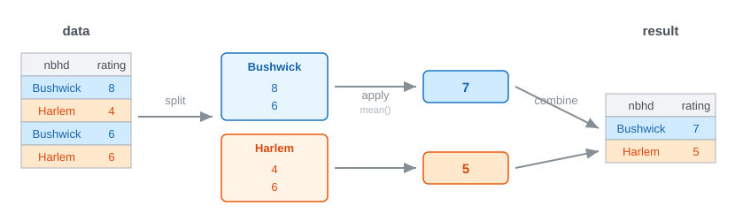

<!-- _class: lead -->
<!-- _paginate: false -->
<!-- _header: "" -->

# CityTech TTP Summer Bootcamp

## Grouping, Collecting, and Protecting Data

**2026-07-09**

---

# Agenda

1. Review
2. Follow-Up: Data Science Careers
3. Grouping with groupby
4. PII and Privacy
5. Collecting Data
6. Practice

---

# Review

What are the most important things you remember from yesterday?

---

# Follow Up: Data Science Careers

Regarding yesterday's discussion:

- What I had said may be **outdated** or **not universally true**
- The data science field is a **spectrum of job roles**
- The specifics **need more research**

---

# Aggregating: groupby

`groupby` answers **per-group questions**: not "what is the average rating?" but "what is the average rating **per neighborhood**?"

- **Split** the rows into groups by a column's value
- **Apply** a calculation to each group (count, sum, mean, min, max)
- **Combine** the results into a new table: one row per group

This three-step pattern is called **split-apply-combine**.

---

# Split-Apply-Combine



`df.groupby("neighborhood")["rating"].mean()`

---

# groupby: Code

```python
# average rating per neighborhood
df.groupby("neighborhood")["rating"].mean()

# how many murals per neighborhood
df.groupby("neighborhood").size()

# count and average together
df.groupby("neighborhood")["rating"].agg(["count", "mean"])
```

Each call returns a new table, indexed by the group.

---

# groupby: Grouping by More

```python
# group by two columns: one row per combination
df.groupby(["neighborhood", "medium"])["rating"].mean()

# name several aggregations at once
df.groupby("neighborhood").agg(
    murals=("m_id", "count"),
    avg_rating=("rating", "mean"),
    newest=("year", "max"),
)
```

---

# Data Sovereignty

**Data sovereignty**: the belief that people should have authority over data about themselves.

Why treat it as a **human right**?

- **Autonomy and dignity**: you should control your own information, not have it taken
- **Privacy is a recognized right**: the UN Declaration of Human Rights protects privacy from arbitrary intrusion
- **Data is power**: whoever holds your data can profile, influence, or exploit you
- **Consent and trust**: people share data expecting it to be respected, not repurposed

This is the **why** behind what follows: handling PII carefully is how we respect that right.

---

# Collective Data Sovereignty

Sovereignty is not only individual: **peoples and communities** claim authority over data about themselves too.

- **Indigenous Data Sovereignty**: the right of Indigenous nations to govern data about their people, lands, and culture
- Grounded in **self-determination** (the UN Declaration on the Rights of Indigenous Peoples)
- The **CARE principles** guide it: **C**ollective benefit, **A**uthority to control, **R**esponsibility, **E**thics
- Some data describes a **group**, so harm and consent are collective, not just individual

---

# What Is PII?

**Personally Identifiable Information**: any data that can identify a specific person, on its own or combined with other data.

- **Direct identifiers**: name, Social Security number, email, phone, home address, passport number
- **Indirect identifiers**: ZIP code, birth date, gender, job title, which identify you *in combination*
- Famous result: **ZIP + birth date + gender** uniquely identifies about **87%** of Americans ([Latanya Sweeney, 2000](https://dataprivacylab.org/projects/identifiability/paper1.pdf))

As soon as your data is about people, you are responsible for the PII in it.

---

# Handling PII: The US

The US has **no single privacy law**. Instead, a **patchwork** of sector-specific and state laws.

- **By sector**: HIPAA (health), FERPA (education), GLBA (finance), COPPA (kids under 13)
- **By state**: California's **CCPA / CPRA** leads; roughly 20 states now have broad privacy laws
- The **FTC** polices "unfair or deceptive" data practices across the board
- Default is **opt-out**: businesses may collect data unless a law restricts it

---

# Handling PII: The EU (GDPR)

The **General Data Protection Regulation** (2018) is one **comprehensive** law covering all personal data.

- Broad scope: **"personal data"** means anything relating to an identifiable person
- A **lawful basis** is required to process data, often **opt-in consent**
- Strong **data subject rights**: access, correct, delete ("right to be forgotten"), export
- Applies to **anyone handling EU residents' data**, anywhere in the world
- Fines up to **4% of global revenue** or €20 million

---

# Working With PII Responsibly

Whatever the law says, good data practice is the same:

- **Minimize**: only collect what you actually need
- **De-identify**: anonymize, pseudonymize, or mask identifiers
- **Aggregate**: report groups, not individuals (where `groupby` helps)
- **Secure**: limit access, encrypt, and delete when you are done

The safest PII is the PII you never collected.

---

# Anonymize and Pseudonymize

**De-identifying** means removing or obscuring PII. Two ways, often confused:

- **Anonymize**: remove identifiers for good, so no one can be re-identified (irreversible)
  - Can be **partial**: keep only a masked stub, like the **last 4 digits** of an SSN
- **Pseudonymize**: swap an identifier for a consistent stand-in, so records still link but the person is hidden
  - A **one-way hash** makes the value **near impossible to reverse**
  - Still counts as **personal data** under GDPR, because it still points to one person

---

# Reducing PII: When

Do it as early as possible:

- **At collection (preferable)**: strip or tokenize PII before it ever lands in your dataset, so raw identifiers are never stored
- **First step in wrangling**: if raw PII does arrive, handle it as the very *first* cleaning step, before any analysis

---

# Anonymize and Pseudonymize: Code

```python
import hashlib

# Anonymize: drop direct identifiers entirely
df = df.drop(columns=["name", "email", "ssn"])

# Pseudonymize: replace an identifier with a salted hash
df["user_id"] = df["email"].apply(
    lambda e: hashlib.sha256((SALT + e).encode()).hexdigest()
)

# Generalize: coarsen quasi-identifiers so they are less unique
df["zip3"] = df["zip"].str[:3]                 # 11201 -> 112
df["age_band"] = pd.cut(df["age"], bins=[0, 18, 30, 50, 65, 120])
```

Keep the `SALT` secret: without it the hash cannot be reversed. A plain, unsalted hash of a guessable value (like an email) can be cracked.

---

# Aggregate: Code

```python
# Report groups, not individuals
summary = df.groupby("zip3").agg(
    people=("user_id", "count"),
    avg_age=("age", "mean"),
)

# Suppress small groups: hide any group of fewer than 5 people
summary = summary[summary["people"] >= 5]
```

Aggregating trades individual rows for group totals, and suppressing tiny groups stops a "group" of one from re-identifying someone.

---

# Class Vote: Is It PII?

For each item, vote: **direct identifier**, **indirect identifier**, or **not PII**?

| # | Data | # | Data |
| --- | --- | --- | --- |
| 1 | Full name | 7 | Email address |
| 2 | Social Security number | 8 | Birth date |
| 3 | ZIP code | 9 | First name only ("Maria") |
| 4 | A squirrel's fur color | 10 | A mural's dimensions |
| 5 | IP address | 11 | License plate number |
| 6 | A company's annual revenue | 12 | Today's temperature in Brooklyn |

---

# Getting Data: Three Sources

Before you can analyze data, you have to get it. Three common sources:

| | Public | Private | Web scraping |
| --- | --- | --- | --- |
| Example | NYC Open Data | your company's CSV | a site with no API |
| Access | open to anyone | internal, restricted | public web pages |
| PII risk | low, pre-scrubbed | high, real people | often high |
| Legal | open license | your data, contracts | gray area (next slide) |

---

# Web Scraping: Legal Considerations

Scraping lives in a legal gray area: "publicly visible" does not mean "free to take."

- **Terms of Service**: many sites forbid scraping; ignoring it can be breach of contract
- **robots.txt**: a site's stated rules for bots; not law, but a norm to respect
- **Copyright**: page content may be protected, even when the raw facts are not
- **Privacy law**: scraping personal data can trigger GDPR / CCPA, even if it is public
- **CFAA (US)**: the "unauthorized access" law; [*hiQ v. LinkedIn*](https://en.wikipedia.org/wiki/HiQ_Labs_v._LinkedIn) eased public-data scraping, but the line is unsettled

Rule of thumb: prefer an official **API or dataset**, and get legal advice when unsure.

---

# Web Scraping: Sites Fight Back

Even where scraping is allowed, sites work to **detect and block bots**:

- **Rate limiting**: throttle or block too many requests from one IP
- **IP blocklists**: ban addresses that behave like bots
- **CAPTCHAs**: make you prove you are human
- **User-agent / header checks**: reject anything that doesn't look like a real browser
- **Login walls**: require an account, which also changes the legal picture
- **JavaScript-rendered content**: data loads dynamically, so a plain HTML fetch sees nothing

Commercial services (Cloudflare, DataDome) and hidden "honeypot" links catch bots too.

---

# Continuing: Fridge Census

Pick up yesterday's fridge dataset and finish the job together.

- Data: `demos/eda-fridge/` - `fridges.csv` + `stocking_log.csv` (5,000 rows each)
- One **driver** (types), one **navigator** (guides) - then switch
- Apply every technique: **rename, fix types, missing, duplicates, standardize, outliers, bin**
- Then **merge** the two tables on `f_id`

(Fake data, generated for practice - messy on purpose.)

---

# Today's Exit Ticket

- [ ] Use **groupby** to answer a per-group question (split, apply, combine)
- [ ] Explain what **PII** is and what **data sovereignty** is
- [ ] Explain how **PII** is handled in the **US** and in the **EU**
- [ ] Explain and perform various methods to **de-identify** data
- [ ] Identify **direct** and **indirect** identifiers in PII
- [ ] Compare **public**, **private**, and **web-scraped** data sources
- [ ] Name **legal** and **technical** considerations for **web scraping**