<!-- _class: lead -->
<!-- _paginate: false -->
<!-- _header: "" -->

# CityTech TTP Summer Bootcamp

## Visualizing Data with seaborn

**2026-07-13**

---

# Agenda

1. Review
2. Why Visualize?
3. Meet seaborn
4. A Tour of seaborn Plots
5. Customizing Plots
6. Code Together and Pair Project

---

# Review

What are the most important things you remember from last week?

---

# Why Visualize?

We can print data as a **table** or crunch it into **summary statistics**. So why bother with charts?

Let's look at one year of bike-share rides **three ways**, and each time ask:

**What is the story in this data?**

*Every number in this example is invented for teaching, not real data.*

---

# The Raw Data

A year of daily bike-share rides. Every value is here, but what is the story?

| date | day | rides | members | casual | avg_min | high_F |
| --- | --- | --- | --- | --- | --- | --- |
| 2025-01-01 | Wed | 8,214 | 6,102 | 2,112 | 10.8 | 41 |
| 2025-01-02 | Thu | 11,905 | 9,431 | 2,474 | 11.3 | 39 |
| 2025-01-03 | Fri | 12,338 | 9,880 | 2,458 | 12.0 | 44 |
| 2025-01-04 | Sat | 9,672 | 5,901 | 3,771 | 13.5 | 46 |
| 2025-01-05 | Sun | 8,431 | 5,204 | 3,227 | 12.9 | 43 |
| ... | | | | | | *(365 rows)* |

*(Invented data, not real.)*

---

# The Summary

Aggregated to one number per month, sorted by average daily rides.

<style>
.cols { display: grid; grid-template-columns: 1fr 1fr; gap: 1.5rem; }
</style>

<div class="cols">
<div>

| Month | Avg rides |
| --- | --- |
| Jul | 61,800 |
| Aug | 60,100 |
| Jun | 58,300 |
| Sep | 49,700 |
| May | 47,900 |
| Oct | 38,200 |

</div>
<div>

| Month | Avg rides |
| --- | --- |
| Apr | 35,300 |
| Nov | 24,100 |
| Mar | 22,400 |
| Dec | 15,400 |
| Feb | 14,200 |
| Jan | 11,900 |

</div>
</div>

*(Invented data, not real.)*

---

# The Same Data, Visualized

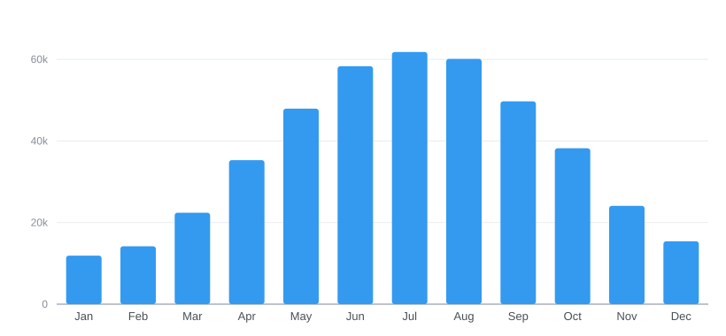

*(Invented data, not real.)*

---

# Why It Matters

Same data, three ways:

- The **raw table** holds everything, but hides the story
- The **summary** is compact, but you still have to read and interpret it
- The **chart** shows it in one second: rides **peak in summer**, bottom out in winter

**Visualization is how we see structure**: trends, cycles, and outliers that raw numbers bury.

---

# Aside: Data Informs Future Decisions

Data science is not only about describing the past; it is about **deciding what to do next**.


**Discuss:** how could you use this data to make better decisions for next year?

*(Invented data, not real.)*

---

# Meet seaborn

**seaborn** is a Python library for **statistical data visualization**, built on top of matplotlib.

- Works **directly with pandas** DataFrames: name your columns, it handles the rest
- **High-level**: good-looking, sensible charts in a line or two
- Built for **exploratory data analysis**: distributions, comparisons, relationships
- Smart defaults for colors, labels, and styling, so you focus on the data

```python
import seaborn as sns

sns.barplot(data=df, x="month", y="rides")   # the chart we just saw
```

---

# Histogram

<div class="cols">
<div>

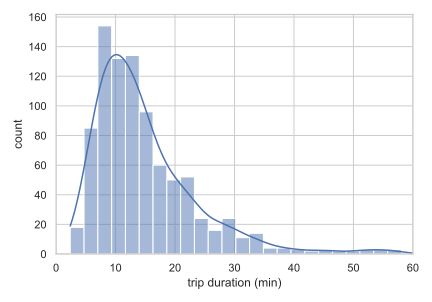

</div>
<div>

**Best for:** the distribution of one numeric variable

**Questions it answers**

- Where do most values fall?
- Is the data skewed or symmetric?
- Are there outliers?

```python
sns.histplot(data=df, x="duration", kde=True)
```

</div>
</div>

*(Invented data, not real.)*

---

# Density (KDE)

<div class="cols">
<div>

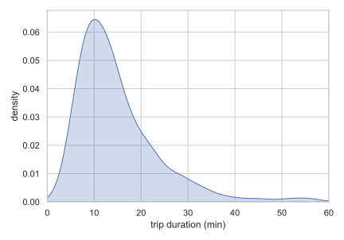

</div>
<div>

**Best for:** a smooth view of one variable's distribution

**Questions it answers**

- What is the overall shape?
- Where is the data most concentrated?
- Is there one peak or several?

```python
sns.kdeplot(data=df, x="duration", fill=True)
```

</div>
</div>

*(Invented data, not real.)*

---

# Box Plot

<div class="cols">
<div>

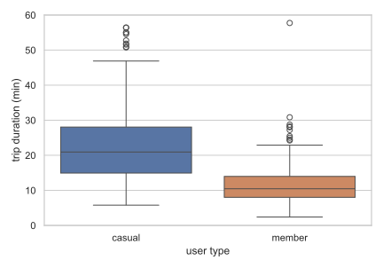

</div>
<div>

**Best for:** comparing distributions across groups, compactly

**Questions it answers**

- How do the medians compare?
- How spread out is each group?
- Which points are outliers?

```python
sns.boxplot(data=df, x="user_type", y="duration")
```

</div>
</div>

*(Invented data, not real.)*

---

# Violin Plot

<div class="cols">
<div>

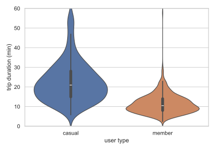

</div>
<div>

**Best for:** comparing the full distribution shape across groups

**Questions it answers**

- How does each group's shape differ?
- Is a group bunched or spread out?
- Is any group bimodal?

```python
sns.violinplot(data=df, x="user_type", y="duration")
```

</div>
</div>

*(Invented data, not real.)*

---

# Scatter Plot

<div class="cols">
<div>

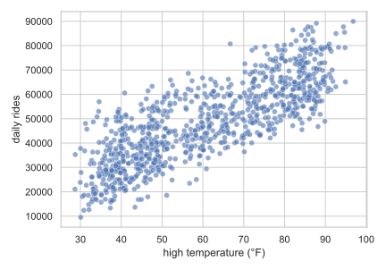

</div>
<div>

**Best for:** the relationship between two numeric variables

**Questions it answers**

- Do the two move together?
- Is the relationship positive or negative?
- Are there clusters or outliers?

```python
sns.scatterplot(data=df, x="temp", y="rides")
```

</div>
</div>

*(Invented data, not real.)*

---

# Line Plot

<div class="cols">
<div>

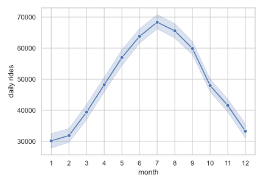

</div>
<div>

**Best for:** how a value changes over an ordered axis, like time

**Questions it answers**

- Is it trending up or down?
- Is there a repeating cycle?
- When did it peak or dip?

```python
sns.lineplot(data=df, x="month", y="rides")
```

</div>
</div>

*(Invented data, not real.)*

---

# Regression Plot

<div class="cols">
<div>

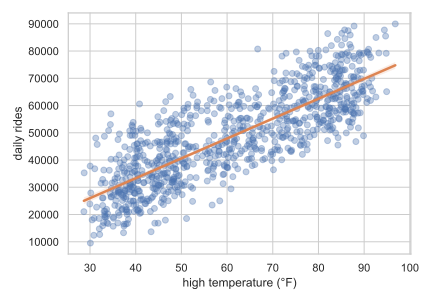

</div>
<div>

**Best for:** a relationship plus a fitted trend line

**Questions it answers**

- What is the trend, and how steep?
- How strong is the relationship?
- What is Y at a given X?

```python
sns.regplot(data=df, x="temp", y="rides")
```

</div>
</div>

*(Invented data, not real.)*

---

# Count Plot

<div class="cols">
<div>

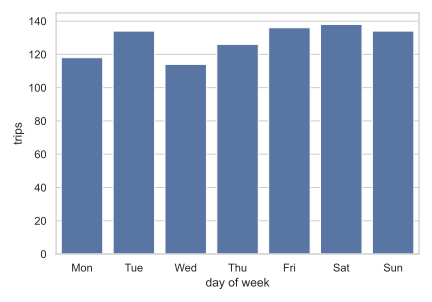

</div>
<div>

**Best for:** how many rows fall in each category

**Questions it answers**

- Which category is most common?
- Which is rare?
- Is the data balanced across categories?

```python
sns.countplot(data=df, x="day")
```

</div>
</div>

*(Invented data, not real.)*

---

# Heatmap

<div class="cols">
<div>

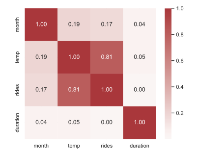

</div>
<div>

**Best for:** a grid of values shown as color, like a correlation matrix

**Questions it answers**

- Which variables move together?
- Where are the strong or weak links?
- Any surprising hot or cold spots?

```python
sns.heatmap(df.corr(), annot=True)
```

</div>
</div>

*(Invented data, not real.)*

---

# Customizing: A Few Changes

<div class="cols">
<div>

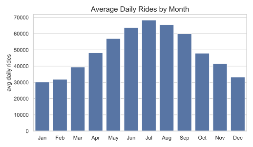

</div>
<div>

A few lines on top of **one seaborn call**:

```python
sns.set_theme(style="whitegrid")
ax = sns.barplot(data=m, x="month",
                 y="rides", color="#4c72b0")
ax.set_title("Average Daily Rides by Month")
ax.set_ylabel("avg daily rides")
ax.set_xlabel("")
```

</div>
</div>

*(Invented data, not real.)*

---

# Customizing: Going Further

<div class="cols">
<div>

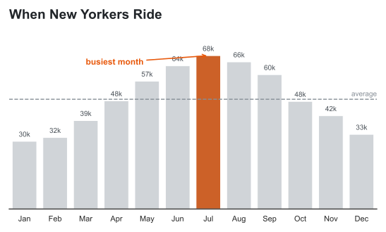

</div>
<div>

The same `barplot`, but seaborn hands you a **matplotlib Axes** to restyle **everything**:

- muted bars, the **peak** highlighted
- **value labels** on each bar
- an **average** reference line
- an **annotation** on the busiest month

</div>
</div>

*(Invented data, not real.)*

---

# Aside: Built on matplotlib

seaborn does not draw anything itself. It is a friendly layer on top of **matplotlib**.

- **matplotlib** is Python's foundational plotting library: powerful, but low-level and verbose
- seaborn calls it for you, with **smart defaults** and far **less code**
- Every seaborn chart is really a matplotlib **Figure** and **Axes**
- So you can drop down to matplotlib to **fine-tune anything** (as we just did)

**seaborn for speed, matplotlib for total control.**

---

# Learn More: Official Docs

- **seaborn**: [seaborn.pydata.org](https://seaborn.pydata.org)
- **matplotlib**: [matplotlib.org](https://matplotlib.org)

Both sites have an **example gallery**: browse the pictures, find the plot you want, and copy its code as a starting point.

---

# Code Together: NYC Open Data

Let's take a **real** dataset from raw to insight together, live.

- **Find**: browse [NYC Open Data](https://opendata.cityofnewyork.us/) and pick a dataset
- **Explore**: `head()`, `info()`, `describe()`, `value_counts()`
- **Clean**: fix types, missing values, duplicates, outliers
- **Visualize**: chart it with **seaborn** to surface the story
- **Insight**: ask a question and let the data answer

---

# Pair Programming: Data for a Better NYC

Pair up, take a real dataset from raw to insight, then **present to the class**. Use data to propose a change that would make life better for NYC residents.

Your presentation should cover:

1. Your **initial questions**
2. How you **chose your dataset**
3. What you did while **cleaning**
4. Your **final visualizations**
5. How your **question evolved** (or didn't)
6. Your **final recommendations**

---

# Today's Exit Ticket

- [ ] Explain why a chart can reveal patterns a table or summary hides
- [ ] Create a **seaborn** plot from a pandas DataFrame
- [ ] Match a question to the right plot (distribution, relationship, comparison)
- [ ] Customize a plot: title, labels, colors, and annotations
- [ ] Use a real dataset to propose and present a data-backed recommendation
