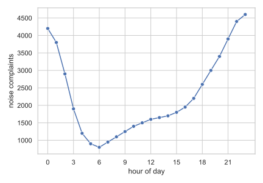
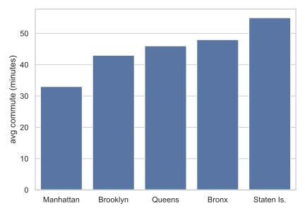
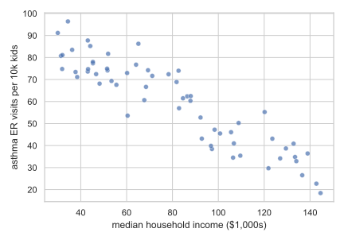
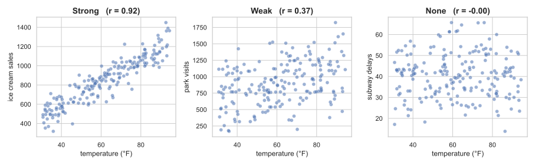
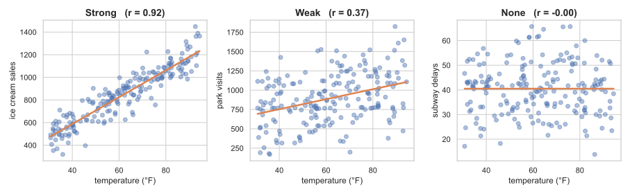
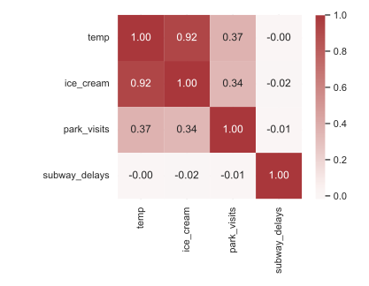
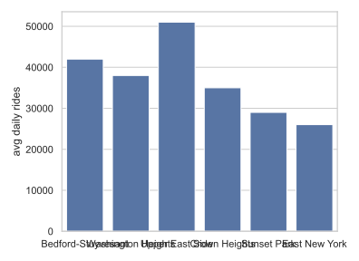
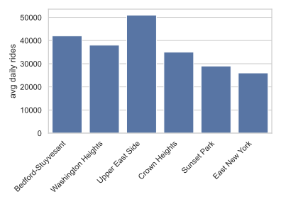

<!-- _class: lead -->
<!-- _paginate: false -->
<!-- _header: "" -->

# CityTech TTP Summer Bootcamp

## Reading Plots and Reshaping Data

**2026-07-14**

---

# Agenda

1. Review
2. Follow-Ups: Reading Plots
3. Follow-Ups: Correlation
4. Follow-Ups: Dropping Down to matplotlib
5. Wide and Long Data
6. Practice

---

# Review

What are the most important things you remember from yesterday?

---

# Follow Up: Plot, Chart, Graph, Visualization

In everyday use these are swapped freely. But each leans a certain way:

- **Plot**: the **technical** term. Data drawn on axes
- **Chart**: the **communication** term. A plot dressed up for an audience
- **Graph**: an everyday synonym, but **ambiguous**. In math and CS, a *graph* is **nodes and edges**, a network
- **Visualization**: the **umbrella**. Any visual encoding of data, including maps, diagrams, and dashboards

These are **generally interchangeable**. Still, try to use **plot** and **graph** correctly: to an engineer, a *graph* may mean a network.

---

# Follow Up: Read Plots Like a Consultant

A chart is not the answer. It is the **start of a conversation**.

- **Describe**: what does the plot actually show?
- **Explain**: what could cause this pattern?
- **Question**: what is missing, or what might mislead you?
- **Recommend**: what should someone *do* about it?

A data scientist reports the pattern. A **consultant** turns it into a **decision**.

---

# NYC: Noise Complaints by Hour

<style>
.cols { display: grid; grid-template-columns: 1fr 1fr; gap: 1.5rem; }
</style>

<div class="cols">
<div>



</div>
<div>

**Study the plot.**

- What stands out?
- What could explain it?
- What would you **recommend** the city do?

</div>
</div>

*(Invented data, not real.)*

---

# NYC: Commute Time by Borough

<div class="cols">
<div>



</div>
<div>

**Study the plot.**

- Who is worst off, and by how much?
- What could explain the gap?
- What would you **recommend** the city do?

</div>
</div>

*(Invented data, not real.)*

---

# NYC: Income and Childhood Asthma

<div class="cols">
<div>



</div>
<div>

**Study the plot.**

- Which way does the relationship run?
- What could explain it?
- What would you **recommend**?
- What does this **not** prove?

</div>
</div>

*(Invented data, not real.)*

---

# Follow Up: One Plot Is Not a Report

A report does not have to be summed up in a **single** plot.

- A complex analysis usually needs **several plots**, each carrying **one point**
- For example, one *might* show a **trend**, another a **breakdown**, another an **exception**
- Together they build the **argument** behind your recommendation
- Do not cram everything into one busy chart just to have "the" chart

If your recommendation is complex, it is **fine** for several clear plots to support it.

---

# Follow Up: What Is `df.corr()`?

Yesterday we called `df.corr()` to build a heatmap. Here is what it actually does.

- It measures how strongly each pair of **numeric** columns **move together**
- It returns a **matrix**: every column against every other column
- Each cell is a number from **-1 to +1**, the correlation coefficient **r**
- The diagonal is always **1.00**: a column matches itself perfectly

```python
df.corr(numeric_only=True)
```

---

# Reading a Correlation

**r**, the **correlation coefficient**, measures how closely two variables move together. It runs from **-1** to **+1**:

- **+1**: perfect **positive**, as one goes up the other goes up
- **0**: **no** linear relationship
- **-1**: perfect **negative**, as one goes up the other goes down

Rough strength: **|r| above 0.7** is strong, **0.3 to 0.7** moderate, **below 0.3** weak.

**Correlation is not causation.** Two things moving together does not mean one causes the other.

---

# Strong, Weak, and None



Same x-axis in all three. The **tighter the cloud hugs a line**, the stronger the correlation.

*(Invented data, not real.)*

---

# The Same Three, With a Line



The orange line is a **linear regression line**, the best straight-line fit through the points. Every panel gets one, even at `r = 0.00`: a line can be fit through **anything**. Correlation measures how **tightly the points hug the line**, not how **steep** it is.

*(Invented data, not real.)*

---

# Seeing It in the Matrix

<div class="cols">
<div>



</div>
<div>

The same three relationships, read straight off `df.corr()`:

- `temp` and `ice_cream`: **0.92** (strong)
- `temp` and `park_visits`: **0.37** (weak)
- `temp` and `subway_delays`: **0.00** (none)

Deeper color = stronger relationship.

</div>
</div>

*(Invented data, not real.)*

---

# Follow Up: Dropping Down to matplotlib

seaborn is a layer on top of **matplotlib**. Sometimes you need the layer underneath.

- seaborn gets you a good chart **fast**, with sensible defaults
- But it does not expose **every** knob
- For fine control (ticks, limits, labels, annotations) you reach for **matplotlib**

A common case: your **x-axis labels overlap**, and you need to **rotate** them.

---

# Rotating the Labels

<div class="cols">
<div>

**seaborn only**



```python
sns.barplot(data=df, x="nbhd",
            y="rides")
```

</div>
<div>

**dropping down to matplotlib**



```python
sns.barplot(data=df, x="nbhd",
            y="rides")
plt.xticks(rotation=45, ha="right")
plt.show()
```

</div>
</div>

*(Invented data, not real.)*

---

# What Changed

1. **Import it**: `import matplotlib.pyplot as plt`
2. **seaborn first, then matplotlib**: seaborn draws the chart, `plt` tweaks the *current* figure
3. **End with `plt.show()`**: required in a script, and it keeps the stray `<Axes: >` line out of your notebook

```python
import seaborn as sns
import matplotlib.pyplot as plt

sns.barplot(data=df, x="nbhd", y="rides")  # seaborn draws
plt.xticks(rotation=45, ha="right")        # matplotlib tweaks
plt.show()                                 # show it, cleanly
```

---

# When to Reach for `plt`

Common reasons to drop down from seaborn into matplotlib:

- **Rotate crowded tick labels**: `plt.xticks(rotation=45)`
- **Resize the figure**: `plt.figure(figsize=(10, 5))`
- **Set the title and axis labels**: `plt.title()`, `plt.xlabel()`
- **Zoom in on the axes**: `plt.xlim()`, `plt.ylim()`
- **Add a reference line**: `plt.axhline(y=average)`
- **Annotate a point**: `plt.annotate("peak", ...)`
- **Save the chart to a file**: `plt.savefig("chart.png", dpi=300)`

Full reference: [the matplotlib.pyplot docs](https://matplotlib.org/stable/api/pyplot_summary.html)

---

# Wide Data and Long Data

The same information can be stored in two very different **shapes**.

- **Wide**: one row per **thing**, with each measurement in its **own column**
- **Long** (also called **tall**): one row per **observation**, with the variable name and its value each in a column

Same numbers. Different shape. And the shape decides what you can **easily** do with them.

---

# Wide Data

One row per borough, and each month gets its own column. This is the **spreadsheet shape** you already know.

| borough | Jan | Feb | Mar | Apr | May | Jun | Jul |
| --- | --- | --- | --- | --- | --- | --- | --- |
| Manhattan | 12 | 14 | 22 | 35 | 48 | 58 | 62 |
| Brooklyn | 9 | 11 | 18 | 28 | 39 | 47 | 51 |
| Queens | 8 | 10 | 16 | 25 | 34 | 41 | 45 |

The month names live in the **column headers**. Add a month, and you add a **column**.

*(Invented data, not real. Average daily rides, in thousands.)*

---

# Long Data

<div class="cols">
<div>

| borough | month | rides |
| --- | --- | --- |
| Manhattan | Jan | 12 |
| Manhattan | Feb | 14 |
| Manhattan | Mar | 22 |
| Manhattan | Apr | 35 |
| Brooklyn | Jan | 9 |
| ... | ... | ... |

</div>
<div>

The same numbers, one row per **observation**.

- The month names became **data** in a `month` column
- Add a month and you add **rows**, not a column
- 3 boroughs × 7 months = **21 rows**

</div>
</div>

*(Invented data, not real.)*

---

# Aside: The Same Idea in SQL

You already met this in SQL, under a different name. Reshaping changes what the **key** is.

- **Wide**: `borough` alone identifies a row. A **single-column key**
- **Long**: you need **`(borough, month)`**. A **composite key**

---

# Why Each Shape Exists

- **Wide is for people**: compact and easy to scan. It is the shape of a report table or a spreadsheet
- **Long is for machines**: every variable is its own column, so tools can **group**, **filter**, and **plot** by column name

seaborn is built for **long** data:

```python
sns.lineplot(data=df, x="month", y="rides", hue="borough")
```

`x`, `y`, and `hue` are all **column names**. In wide form there is no `month` column to point `x` at.

---

# Wide to Long: `melt()`

**`melt()` takes wide data and makes it long.** The columns melt *down* into rows.

```python
long = wide.melt(
    id_vars="borough",
    var_name="month",
    value_name="rides",
)
```

- **`id_vars`**: the columns to **keep** as they are
- **`var_name`**: the name for the column made from the **old headers**
- **`value_name`**: the name for the column made from the **values**

The 3-row wide table becomes a **21-row** long table.

---

# Long to Wide: `pivot()`

**`pivot()` takes long data and makes it wide.** The rows pivot *up* into columns.

```python
wide = long.pivot(
    index="borough",
    columns="month",
    values="rides",
)
```

- **`index`**: the column that becomes the **rows**
- **`columns`**: the column whose values become the **new headers**
- **`values`**: the column that **fills the cells**

`melt` and `pivot` are **inverses**. If a pair repeats, use `pivot_table()`, which aggregates.

---

# Demo: Tall vs Wide Squirrels

See it on **real** data: `demos/tall-wide-squirrel/`

- The squirrel census stores each activity (`running`, `eating`, ...) as its **own column**: wide data
- The notebook first tries to answer "which activity is most common?" **without** reshaping, and struggles
- Then `melt()` makes it long, and the answer takes **one call**
- Finally `pivot_table()` turns it back into a wide table for a report

Open `tall_wide_squirrel.ipynb` and run it top to bottom.

---

# Continue: Data for a Better NYC

Pick up yesterday's pair project and finish it.

- Data: your real dataset from [NYC Open Data](https://opendata.cityofnewyork.us/)
- Bring in today's tools: **`df.corr()`**, reshaping (**`melt`** / **`pivot`**), and **matplotlib** polish
- Your report can hold **several plots**, not just one
- Build the notebook like a **report**: markdown cells around your charts

Still present: your **questions**, dataset choice, **cleaning**, final **visualizations**, how the question **evolved**, and your **recommendations**.

---

# Today's Exit Ticket

- [ ] Read a plot and turn it into an **insight** and a **recommendation**
- [ ] Explain what **`df.corr()`** measures, and read a correlation from **-1 to +1**
- [ ] Explain why **correlation is not causation**
- [ ] Drop down to **matplotlib** to fix a chart, for example rotating the labels
- [ ] Explain the difference between **wide** and **long** data
- [ ] Use **`melt()`** and **`pivot()`** to reshape a DataFrame
