<!-- _class: lead -->
<!-- _paginate: false -->
<!-- _header: "" -->

# CityTech TTP Summer Bootcamp

## Interpreting and Communicating Data

**2026-07-15**

---

# Agenda

1. Review
2. Follow-Ups
3. Reports and Dashboards
4. Interactive Charts with Plotly
5. Group Project

---

# Review

What are the most important things you remember from yesterday?

---

# Follow Up: Copying a DataFrame

Assigning a DataFrame does **not** copy it, unless you ask.

<style>
.cols { display: grid; grid-template-columns: 1fr 1fr; gap: 1.5rem; }
</style>

<div class="cols">
<div>

**Copy by reference**

```python
df2 = df
df2["x"] = 0

# df changed too:
# one object, two names
```

</div>
<div>

**Copy by value**

```python
df3 = df.copy()
df3["x"] = 0

# df untouched:
# a separate object
```

</div>
</div>

Plain assignment is **by reference**. Use **`.copy()`** for an independent copy.

---

# Follow Up: Absolute Numbers Can Mislead

<style>
.cols { display: grid; grid-template-columns: 1fr 1fr; gap: 1.5rem; }
</style>

<div class="cols">
<div>

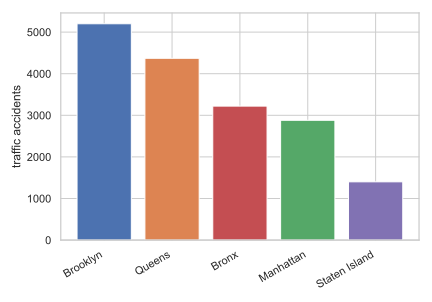

</div>
<div>

**Brooklyn** has the most accidents, nearly **4x** Staten Island.

So Brooklyn is the most dangerous borough.

Case closed?

</div>
</div>

*(Invented data, not real.)*

---

# Bigger Groups Have Bigger Counts

Brooklyn has the most accidents because Brooklyn has the most **people**.

- A chart of **raw counts** is usually a chart of **how big each group is**
- A count answers "how many?", never "how risky?"
- The neighborhood with the most **311 complaints** may just be the one with the most **residents**
- Without a denominator, the count mostly reflects **group size**

---

# One Solution: Divide by Population

<div class="cols">
<div>

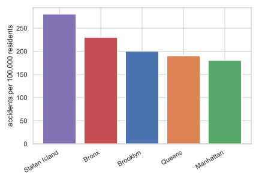

</div>
<div>

Per **100,000 residents** answers "how risky?" The ranking **flips**:

- **Staten Island**: *last* by count, **first** by rate
- **Brooklyn**: *first* by count, only **third** by rate

```python
df["per_100k"] = (
    df["accidents"]
    / df["population"] * 100_000
)
```

</div>
</div>

*(Invented data, not real.)*

---

# The Usual View: Stacked Counts

<div class="cols">
<div>

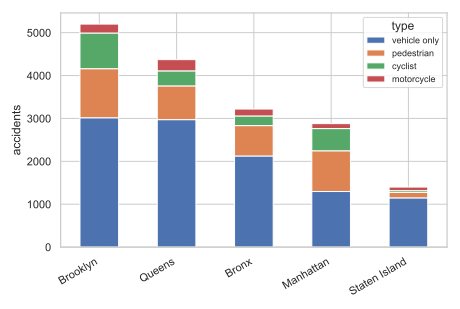

</div>
<div>

Break each borough's accidents down by **type**, as a stacked bar.

- Familiar, but the bars still track **borough size**
- Brooklyn's is tallest because Brooklyn is **biggest**, not because its mix differs
- Hard to compare the **mix** across boroughs

</div>
</div>

*(Invented data, not real.)*

---

# A Second Solution: Percent of Total

<div class="cols">
<div>

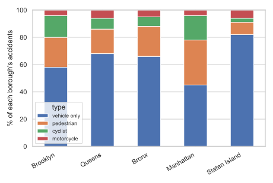

</div>
<div>

Normalize each bar to **100%** to compare the **mix** directly.

- Manhattan is **pedestrian and cyclist** heavy
- Staten Island is almost all **vehicle only**

```python
shares = pd.crosstab(
    df["borough"],
    df["type"],
    normalize="index",
)
shares.plot(kind="bar", stacked=True)
```

</div>
</div>

*(Invented data, not real.)*

---

# Follow Up: Disaggregation

**Disaggregation**: break a total apart into meaningful subgroups instead of reporting one number.

- A single average is often **nobody's** experience: it hides the groups inside it
- We have been doing this: citywide accidents, split **by borough**, then **by type**
- Break down by whatever the question needs: **age, income, time of day, neighborhood**

Disaggregating helps us **understand the data more deeply** than any single total can.

---

# Disaggregating Changes the Story

<div class="cols">
<div>

**Aggregated**

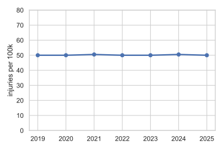

Citywide, the rate looks **flat**. Nothing to see.

</div>
<div>

**Disaggregated by age**

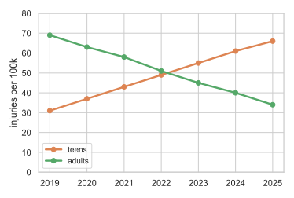

Teens **rising**, adults **falling**. The total hid both.

</div>
</div>

*(Invented data, not real.)*

---

# Follow Up: Stay Skeptical

Having a dataset is not the same as having an **answer**. Good scientists are **skeptical**, especially of their own first read.

- Do not rush to a conclusion just because you have data
- Ask what **context** or **other variables** are missing
- This matters most with **real-world data**, which is always partial
- A finding usually **raises more questions** than it settles

The honest loop: a **question** and some **data** lead to **better questions**.

---

# Follow Up: Data Science and Public Health

Public health runs on data science. Much of what we did today is how epidemiologists work every day.

- **Surveillance**: track cases across time and place (COVID and flu dashboards)
- **Risk factors**: link exposures to outcomes (smoking and lung cancer, air and asthma)
- **Disparities**: disaggregate by race, income, or ZIP to find who is underserved
- **Rates**: age-adjusted deaths per 100,000, not raw counts

And the field's founding moment was itself a **data visualization**.

---

# The First Data Map: John Snow, 1854

<div class="cols">
<div>


</div>
<div>

Cholera was killing **Soho, London**. Snow **plotted each death** on a street map.

- Deaths **clustered** at one pump: **Broad Street**
- That meant **contaminated water**, not "bad air"
- Invisible in a table, obvious on a **map**

It helped launch modern **epidemiology**.

</div>
</div>

*(Public domain, John Snow, 1854.)*

---

# Follow Up: Speak the Language

Using the **right terminology** is not pedantry. It is a **social signal**.

- Jargon is a **shibboleth**: an inside-group marker that says "I am one of you"
- Meeting someone in the field, or in a **job interview**, the right word builds an **instant connection**
- It shows you **"know ball"**: that you have done the real work, not just read about it
- A vague or wrong word quietly signals the opposite

This is why we are picky about **terminology** on these slides, and in our discussions. Learn the words, and use them **confidently** and **naturally**: forced or hesitant jargon undercuts the effect.

---

# Reports and Dashboards

Two ways to deliver what you found.

- A **report** tells **one story**, start to finish: fixed and curated, like a document or a slide deck
- A **dashboard** lets the reader **explore**: interactive, filterable, and always current

Same data, two very different deliverables. The right choice depends on your **audience** and their **question**.

---

# Reports vs Dashboards

| | **Report** | **Dashboard** |
| --- | --- | --- |
| Shape | a fixed narrative | an interactive view |
| Who steers | you tell the story | the reader picks the path |
| Reader needs | only to read it | some skill to drive it |
| Freshness | a snapshot in time | updates with the data |
| Best for | a decision or conclusion | exploration and monitoring |
| Main risk | it goes stale | the reader can mislead themselves |
| Effort | write it once | build it, then maintain it |

---

# Where You See Each

**Reports**

- A quarterly PDF, a research paper, an analysis notebook, a slide deck

**Dashboards**

- A COVID case tracker, a Tableau or Power BI board, a Streamlit app, the NYC 311 map

Notice the pattern: dashboards tend to win when data is **critical and timely**. A quarterly PDF, or a study that takes **months or years** to publish, is too slow to act on.

---

# Meet Plotly

**Plotly** makes **interactive** charts in Python (and JavaScript).

- Charts are **interactive by default**: hover, zoom, pan, toggle series
- **`plotly.express`** (`px`) is the high-level API, one-liners like seaborn
- Renders in a **notebook** or exports to a standalone **web page**
- The natural fit for **dashboards**, where seaborn fits **reports**

```python
import plotly.express as px

px.scatter(df, x="x", y="y", color="fur_color")
```

---

# Plotly: A Map of Squirrels

<div class="cols">
<div>

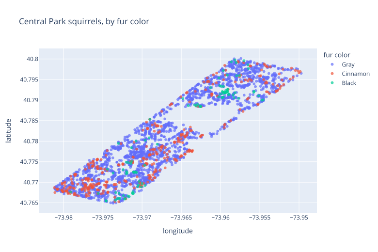

</div>
<div>

Each squirrel has an `x` and `y`, so plotting them draws **Central Park**.

```python
px.scatter(
    df, x="x", y="y",
    color="primary_fur_color",
)
```

Live, you can **hover** any point and **zoom** into any corner.

</div>
</div>

*(Real data: 2018 Squirrel Census.)*

---

# Plotly: Same Idea, Any Chart

<div class="cols">
<div>

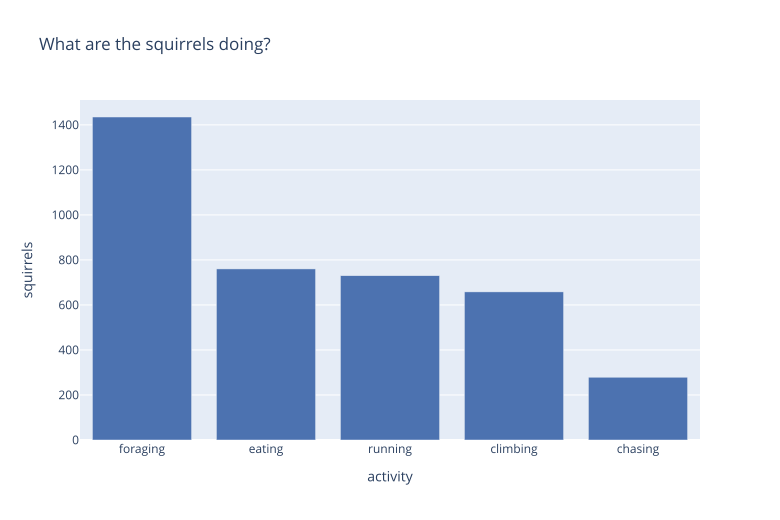

</div>
<div>

Same `px` pattern, different chart:

```python
px.bar(
    counts,
    x="activity", y="squirrels",
)
```

What plotly adds over a static image:

- **Hover** for exact values
- **Zoom** and **pan**
- **Click a legend entry** to hide a series

</div>
</div>

*(Real data: 2018 Squirrel Census.)*

---

# Plotly: A Whole Gallery

<style>
.gal { display: grid; grid-template-columns: 1fr 1fr; gap: 0.4rem 1.5rem; justify-items: center; }
.gal p { margin: 0; }
</style>

<div class="gal">

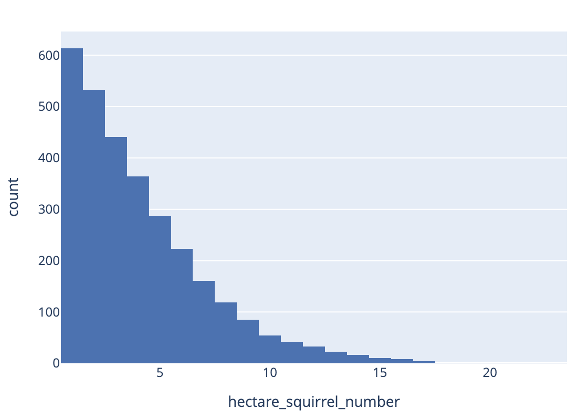

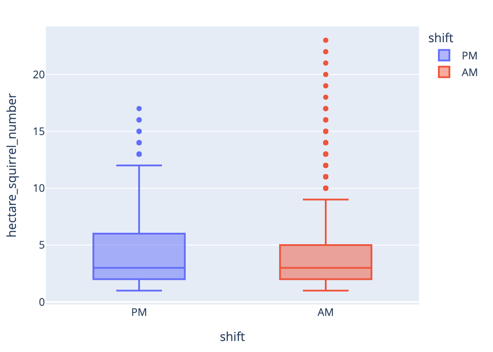

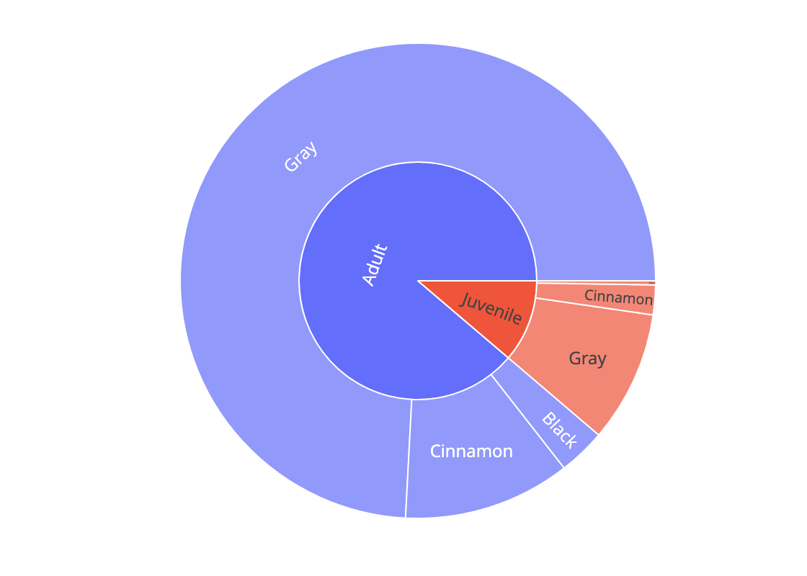

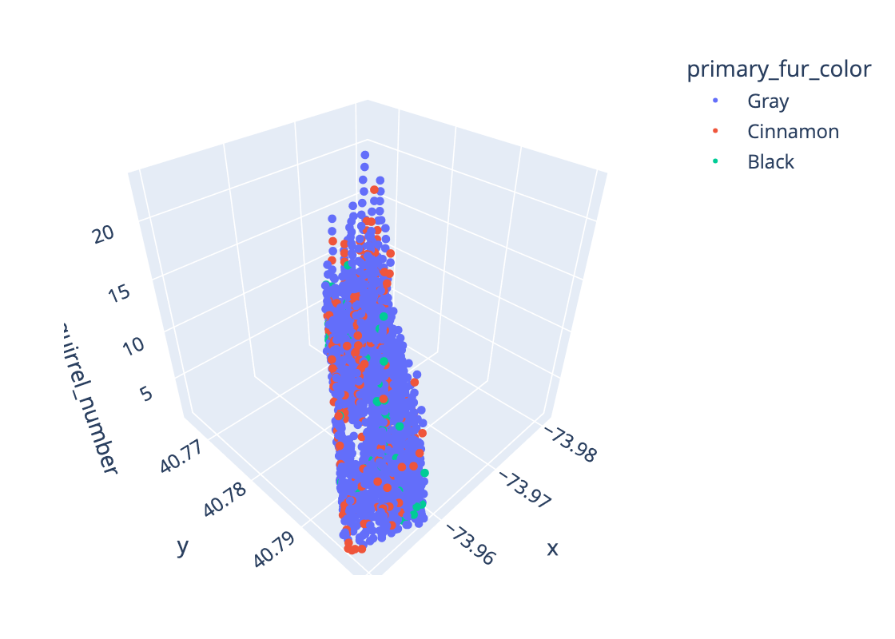

</div>

Dozens of chart types, including **hierarchical** and **3D** views you can rotate. Browse them all in the [official Plotly gallery](https://plotly.com/python/).

*(Real data: 2018 Squirrel Census.)*

---

# Demo: Interactive Charts with Plotly

Open `demos/plotly-intro/plotly_intro.ipynb` and **run it** to feel the difference.

- A **map** of the squirrels you can hover and zoom
- The same chart recolored by **age**, with one changed argument
- Exporting a figure to a standalone **web page** with `write_html`

Static on GitHub, **interactive** when you run it in Jupyter.

---

# Group Project: Data for a Better NYC

Teams of **2**. Use data to propose a change that would improve life for NYC residents.

- Use **at least two datasets**; at least one from [NYC Open Data](https://opendata.cityofnewyork.us/)
- The datasets must **work together**: merged, compared, or one giving context (like population for rates)
- Deliver a report-style **Jupyter notebook** (markdown and visualizations) and a **presentation**
- **Due 2026-07-21**: you present your findings in class

Full spec: `project_specs/data-for-a-better-nyc.md`

---

# Today's Exit Ticket

- [ ] Explain **copy by reference** vs **copy by value** (`df2 = df` vs `df.copy()`)
- [ ] Explain why a **raw count** can mislead, and use a **rate** instead
- [ ] **Disaggregate** a total to surface a pattern the aggregate hides
- [ ] Compare a **report** and a **dashboard**, and say when each fits
- [ ] Make an interactive chart with **Plotly**
- [ ] Use the **right terminology** confidently when talking about your work
