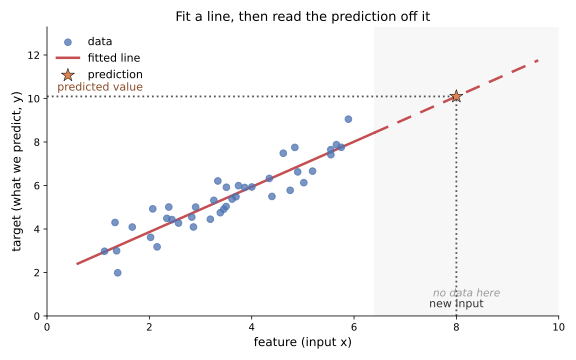
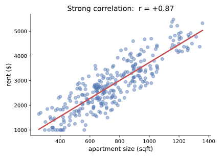
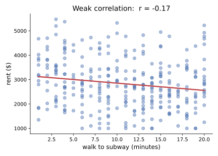
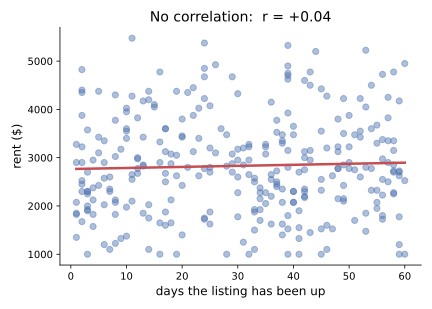

<!-- _class: lead -->
<!-- _paginate: false -->
<!-- _header: "" -->

# CityTech TTP Summer Bootcamp

## Predicting with Machine Learning

**2026-07-16**

---

# Agenda

1. Review
2. Follow up: data you can trust
3. Recharts: interactive charts in React
4. Machine learning and prediction
5. Linear regression: make, fit, predict
6. Reading a model and choosing features
7. Demos and project work

---

# Review

What are the most important things you remember from yesterday?

---

# Follow Up: Missing or Untrustworthy Data

Not every question has data behind it, and not all data is worth using.

- The data you want may **not exist**, or may **not have been collected yet**
- A **gap** is itself a finding: name it, do not paper over it
- Some data is **poor or questionable**: biased, badly measured, or out of date
- If you cannot trust it, it is often better to **leave it out** than to build on it

"We don't have good data on that" is an **honest answer**. A conclusion from bad data is worse than none.

---

# Follow Up: Read the Data Dictionary

A **data dictionary** explains what each column actually means.

- Column names are often **cryptic** (`bbl`, `insp_dt`, `cd`); the dictionary defines them
- It lists each field's **meaning**, **type**, **units**, and **allowed values**
- On **NYC Open Data**, it is sometimes a **separate download**, often an **Excel (`.xlsx`) file**
- Read it **before** you analyze, so you do not misread a column

---

# A Living Example: EduGame

A free, open source classroom quiz game (think Kahoot) that I built as a **living artifact** of this course.

- Made from what you are learning: **full stack development**, **networking**, **Ionic React**, **Recharts** dashboards, **PII** and data privacy, and statistics
- For me, a **capstone**: many course ideas in one working project
- Most importantly, an example of **ethical and effective AI use** as a building tool
- Every prompt I gave **Claude Code** is recorded verbatim in **`COLLABORATION.md`**

Read it to build **intuition**: real code and real decisions, out in the open.

[github.com/jonathan-chin/edugame](https://github.com/jonathan-chin/edugame)

---

# Introducing Recharts

**Recharts** makes charts inside a **React app**, built from **components**.

- Like **Plotly**, its charts are **interactive**: hover, tooltips, responsive
- Unlike Plotly (Python, in a notebook), Recharts lives in your **React web app**
- Built for **dashboards you ship**, using the React you learned in Week 5
- Data is a plain **array of objects**, one per point

If Plotly is interactive charts for **Python**, Recharts is interactive charts for **React**.

---

# Recharts: A Chart Is Components

Where Plotly is one call (`px.line(df, x="month", y="rides")`), Recharts is **composed** from pieces.

```jsx
const data = [{ month: "Jan", rides: 12 }, { month: "Feb", rides: 14 }];

<LineChart width={600} height={300} data={data}>
  <XAxis dataKey="month" />
  <YAxis />
  <Tooltip />
  <Line dataKey="rides" stroke="#4c72b0" />
</LineChart>
```

Each part is a **component** you add: axes, a tooltip, a line. Add another `<Line>` to plot a second series.

---

# Plotly vs Recharts

| | **Plotly** | **Recharts** |
| --- | --- | --- |
| Language | Python (also JS) | JavaScript / React |
| Lives in | a notebook or web page | your React app |
| You write | one **function call** | **composed components** |
| Data shape | a DataFrame | an array of objects |
| Interactive | yes | yes |
| Best for | quick analysis and dashboards | charts built into a product |

---

# Demo: Recharts in an Ionic App

Run `demos/recharts-squirrels/` to see Recharts inside a real **Ionic** app.

- A **bar**, a **pie**, and a **scatter** chart of the Squirrel Census, each in an `IonCard`
- Charts are **interactive** and **resize** with their card (`ResponsiveContainer`)
- The scatter's `x` and `y` points trace out **Central Park**

```bash
cd demos/recharts-squirrels
yarn install
yarn dev
```

---

# What Is Machine Learning?

**Machine learning** finds the patterns in data instead of you hard coding the rules.

- Traditional code: **you** write the rules, the computer follows them
- Machine learning: you show it **examples**, and it learns the rule itself
- It lives on **data**: the cleaner and richer, the better it works
- Everything this week (loading, cleaning, understanding data) is the setup for this

A **model** is the rule the machine learns: a formula that turns inputs into a prediction.

You already did the hard part. ML is one more thing you can do with tidy data.

---

# Machine Learning as Prediction

Many models do one thing: **learn from past examples, then predict on new inputs**.

- **Feature(s)**, the **independent variable(s)**: the input you know (an apartment's square footage)
- **Target**, the **dependent variable**: the answer you want; it *depends* on the features (its monthly rent)
- **Train**: show the model many `(features -> target)` examples
- **Predict**: hand it a new input, get a predicted target back

Same idea, three names: feature = input = independent variable; target = output = dependent variable.

---

# Different Kinds of Models

There is no single "ML model"; you pick one to match the question.

- **Regression**: predict a **number** (a home's price), fitting a **line** (linear) or a **curve** (polynomial)
- **Classification**: predict a **category** (spam or not, which borough)
- **Clustering**: **group** similar rows with no answer key (k means)

Each kind has many specific models. Step one is always: **what kind of question am I asking?**

---

# Starting with Linear Regression

Of all the models, we start today with **linear regression**: predict a **number** from other numbers.

- It predicts a number: a good match for "how much rent?"
- **Simple and fast**: the right first model to try
- **Interpretable**: it hands you back a slope and an intercept you can read
- It is the **regression line** from seaborn, now as code you can predict with

Start simple. Reach for a fancier model only when a simple one is not enough.

---

# What Linear Regression Does

<style>
.cols { display: grid; grid-template-columns: 1fr 1fr; gap: 1.5rem; align-items: center; }
</style>

<div class="cols">
<div>



</div>
<div>

It draws the **best line** through the data.

For a **new input**, it reads the **prediction** straight off that line.

It predicts even in the **blank space** where you have no data, by following the line.

</div>
</div>

---

# Introducing scikit-learn

**scikit-learn** (`sklearn`) is Python's standard **machine learning** library.

- Dozens of models behind **one consistent interface**: `make -> fit -> predict`
- Learn the pattern once and every model feels familiar
- Ships with tools for **splitting data**, **scoring**, and **preparing features**
- Free, open source, and the default choice for classic ML

Docs: [scikit-learn.org](https://scikit-learn.org/stable/) · install with `%pip install scikit-learn` (run it in a notebook cell)

---

# The Code: make, fit, predict

Three steps, and **every** scikit learn model follows them.

```python
from sklearn.linear_model import LinearRegression

X = apts[["size_sqft"]]   # feature(s): the input, always 2D
y = apts["rent"]          # target: what you predict, 1D

model = LinearRegression()   # 1. make the model
model.fit(X, y)              # 2. train it on the examples
model.predict([[800]])       # 3. predict rent for an 800 sqft apartment
```

`.fit()` is the training. On small data it is basically instant.

---

# Reading What It Learned

After `.fit()`, the model can **show its work**.

```python
model.coef_        # the slope(s): how much rent moves per unit of a feature
model.intercept_   # the baseline rent
```

Together, `coef_` and `intercept_` are the **line** the model drew through the data.

---

# Coefficient and Intercept: What They Mean

Read them as the story of the line.

- **Coefficient**: how much the target moves for a **one unit** increase in that feature, holding the others fixed
- Its **sign** is the direction: `+` pushes rent up, `-` pulls it down (`subway_min` is negative)
- A **bigger magnitude** means a stronger effect, but units matter: dollars per sqft is not dollars per bedroom
- **Intercept**: the prediction when **every feature is 0**, often just where the line starts rather than a real apartment

If you can say what each number means, you understand your model.

---

# R-squared: How Good Is the Fit?

```python
model.score(X, y)   # R-squared: a number from 0 to 1
```

- **R-squared** is the share of the variation in the target the model **explains**
- **0**: no better than always guessing the average; **1**: a perfect fit
- It is the **`r`** from earlier this week, **squared**
- Our rent model climbed from **0.76** (size only) to **0.95** (more features)

Higher is better, but a high R-squared is still not proof the model is right.

---

# Choosing Features (Feature Selection)

Not every column helps. Pick features that actually relate to the target.

- **Strong correlation** (positive or negative) carries real signal: a **good** feature
- **Weak correlation** helps only a little: use with care
- **No correlation** is **useless**: it just adds noise
- Check before you add, with correlations or a **correlation heatmap** (in the demo)

Good features in, better predictions out.

---

# A Strong Feature



**size_sqft** tracks rent closely (`r = +0.87`): a clear line, a **good** feature.

---

# A Weak Feature



**subway_min** leans the right way (`r = -0.17`), but the cloud is loose: weak signal.

---

# A Useless Feature



**days_listed** has **no relationship** to rent (`r = +0.04`): a flat line. **Leave it out**.

---

# Demo: Train a Model in Jupyter

Open `demos/linear-regression-intro/` to make, fit, and predict on real data.

- Uses an invented **NYC rent** dataset: predict **rent** from an apartment's features
- Walks the full loop: load, `fit`, `predict`, then read `coef_` and `score`
- Uses a **correlation heatmap** to choose good features, and plots the fitted line

---

# Today's Exit Ticket

- [ ] Decide when to **leave out** missing or untrustworthy data, and use a **data dictionary**
- [ ] Build an interactive chart with **Recharts** in a React app
- [ ] Explain what a **machine learning model** does, and name the **independent** and **dependent** variables
- [ ] Train a linear regression with scikit-learn's **make, fit, predict** steps
- [ ] Interpret a **coefficient** and the **intercept** of a linear regression
- [ ] Explain what **R-squared** says about a model's fit
- [ ] Pick good **features** by their **correlation** with the target, and drop the useless ones
