<!-- _class: lead -->
<!-- _paginate: false -->
<!-- _header: "" -->

# CityTech TTP Summer Bootcamp

## Mini Workshop: React State Management and Zustand

**2026-08-06**

---

# Agenda

1. Local state: `useState` in one component
2. When components need to share state
3. The pain of prop drilling
4. Context: React's built-in solution
5. Zustand: our class's preferred solution

---

# Local State: `useState` in One Component


- `useState` creates state that lives **inside one component**
- Only `Counter` can read it or update it
- Clicking calls `setCount`, which re-renders `Counter` with the new value
- Nothing outside `Counter` knows this state exists

---

# When Components Need to Share State

<style>
.cols { display: grid; grid-template-columns: 1fr 1fr; gap: 1.5rem; align-items: center; }
.cols img { display: block; margin: 0 auto; }
</style>

<div class="cols">
<div>



</div>
<div>

- `ProductList` adds items, `CartSummary` shows how many - both need the same `cartItems`
- Neither component can see the other's local `useState`
- One common fix: **lift the state up** to their closest shared parent, then pass it down as props

</div>
</div>

---

# The Pain of Prop Drilling

<style>
.cols { display: grid; grid-template-columns: 1fr 1fr; gap: 1.5rem; align-items: center; }
.cols img { display: block; margin: 0 auto; }
</style>

<div class="cols">
<div>



</div>
<div>

- Lifting state up works - but the value has to pass through **every level** in between
- `Layout` and `Sidebar` (highlighted) never use `cartItems` - they only forward it as a prop
- Rename or restructure that prop, and every file in the chain has to change

</div>
</div>

---

# Context: React's Built-in Solution

**Context** lets a parent provide a value that any descendant can read directly, no matter how deep, without passing it through every level in between.

- Built into React - no extra library to install
- Best for state that changes **rarely**: theme, logged-in user, locale
- Three pieces: `createContext`, a `<Provider>` that holds the value, and `useContext` to read it

---

# Context: Code Example

```jsx
// CartContext.js
const CartContext = createContext();

export function CartProvider({ children }) {
  const [cartItems, setCartItems] = useState([]);
  return (
    <CartContext.Provider value={{ cartItems, setCartItems }}>
      {children}
    </CartContext.Provider>
  );
}
```

```jsx
// CartSummary.jsx - anywhere inside <CartProvider>, no props needed
function CartSummary() {
  const { cartItems } = useContext(CartContext);
  return <p>{cartItems.length} items in cart</p>;
}
```

---

# Context: Reaching Deeply Nested Components



<style>
section img:not(.emoji) { display: block; margin: 0.4em auto; }
</style>

---

# Context: Follow Up

- Any component that reads a context **re-renders on every change** to its value, even parts it doesn't use
- A great fit for state that's genuinely app-wide but changes rarely, like theme, locale, or the logged-in user
- Official docs: [react.dev - Passing Data Deeply with Context](https://react.dev/learn/passing-data-deeply-with-context)

---

# Zustand: Our Class's Preferred Solution

**Zustand** is a small state management library: a store that lives **outside** the component tree.

- **No provider needed** - components import the store hook directly
- Components subscribe to just the **slice of state they read**
- Minimal boilerplate - no actions, reducers, or dispatch
- Our default choice for shared state: simpler to wire up than Context, and only re-renders what actually changed

---

# Zustand: Code Example

```js
// store/useCartStore.js
import { create } from "zustand";

const useCartStore = create((set) => ({
  cartItems: [],
  addItem: (item) =>
    set((state) => ({ cartItems: [...state.cartItems, item] })),
}));

export default useCartStore;
```

```jsx
// CartSummary.jsx - no provider, no props, just import the store
function CartSummary() {
  const cartItems = useCartStore((state) => state.cartItems);
  return <p>{cartItems.length} items in cart</p>;
}
```

---

# Zustand: Follow Up

- The selector `(state) => state.cartItems` keeps re-renders scoped: this component only updates when `cartItems` changes
- State and the actions that update it live together in the same `create()` call
- No context, no provider tree, no wrapping `<App>` - just one import per component
- Official docs: [zustand.docs.pmnd.rs](https://zustand.docs.pmnd.rs/)

---

# Zustand: How Components Connect to the Store



<style>
section img:not(.emoji) { display: block; margin: 0.4em auto; }
</style>
